Pay special attention
---------------------

1. This product contains small parts. Do not swallow. 2. Do not allow
children under 3 years of age to play with or near this product. . 3. Do
not allow children who lack safety capabilities to use this product
without parental supervision. 4. Do not use this product or its
components near any AC power sockets or other circuits to avoid the risk
of electric shock. 5. Do not use in the vicinity of liquid or fire. 6.
Keep conductive material refrain from the product 7. Do not store or use
the product under extreme conditions such as high or low temperature and
high humidity. 8. Please turn off the circuit when leaving or not using
the product. 9. Do not touch any moving or rotating parts of the product
when operating the product. 10. It is normal that parts of the product
may become hot when used in certain circuit designs. Improper handling
may result in overheating. 11. Failure to use the product in accordance
with specifications may damage the product.

Resource Download
-----------------

To help you quickly obtain related codes, libraries, and other support
files for this product, please click the links below to download: -
`Makecode Code and library downloads <%5B%5D(../Makecode/Code.7z)>`__ -
`Python Code and library
downloads <%5B%5D(../Python/Python%20Code.7z)>`__

Product Introduction
--------------------

|image1|

Have you wondered to learn programming or have your own programming
robot? Nowadays, programming has developed to a lower age group, and it
will be a trend for everyone thanks to the spread of simple graphical
programming platforms, from micro:bit to Arduino and Raspberry Pi. Maybe
you haven’t heard of them before. However, with the help of this product
and tutorial, you can easily install a multi-functional programming car
and experience the fun of being a maker.

Micro:bit is a highly integrated microcontroller with powerful functions
and small size. It is very suitable to be applied in STEAM education for
its functions to make robots, wearable devices and electronic
interactive games via the combination of code programming and graphical
programming.

This Keyestudio 4WD Mecanum Robot Car V2.0 is a smart DIY car dedicated
to micro:bit. The smart car consists of a car body with extended
functions, a PCB base plate with integrated motor drive sensors, 4
decelerating DC motors, Mecanum wheels, various modules and sensors as
well as acrylic boards. Therefore, you can easily assemble a cool
Mecanum wheel 4WD smart car by yourself，and then use Microsoft’s online
graphical programming platform Make Code to program the micro:bit
control board to control the car. In the process, you can not only
experience the fun of creation but enhance hands-on ability and learn
programming skills as well.

MakeCode for micro:bit is the most widely used graphical programming
environment on the micro:bit official website. It is based on the
graphical programming environment developed by Microsoft’s open source
project MakeCode. This graphical programming can also be converted to
code languages, python and javascript language, making it more
accessible to learn programming. At the same time, MakeCode programming
can be simulated or programmed for actual electronic components.

For your convenience, source code has been provided in every project, as
well as code programming steps and code explanation in details. Hope you
can better understand them.

Product Description
-------------------

This product is a smart car based on Micro:bit. It integrates a host of
functions such as ultrasonic following, line tracking, infrared control
as well as Bluetooth control. There is a passive buzzer to play music, 4
WS2812RGB LEDs to display different colors, 2 seven-color lights to make
direction lights for the car. This product uses two 18650 lithium
batteries for power supply.

When installing and disassembling the battery, please pay attention to
the positive and negative poles of the battery, and be sure not to
reverse them. By the way, the motor speed of this product is adjustable.

In order to provide you with better experience, corresponding documents
about installation and test code are also provided.

Product Parameters
------------------

- Connector port input: DC 7V–9V

- Operating voltage of driver board system: 5V

- Standard operating power consumption: about 2.2W

- Maximum power: 12W

- Motor speed: 200RPM

- Working temperature range: 0-50℃

- Size: 120*120*120mm

- Environmental protection attributes: ROHS

**Note:** The working voltage of micro:bit is 3.3V, and the driver
shield integrates a 3.3V/5V communication conversion circuit.

Product Kit list
----------------

Please check the list to ensure that all parts are intact. If you find
missing ones, please contact our sales staff immediately.

+-----------------+-----------------+---------------------------------+-----------------+
| #               | Picture         | Name                            | QTY             |
+=================+=================+=================================+=================+
| 1               | |image2|        | Acrylic Board T=3mm             | 1               |
+-----------------+-----------------+---------------------------------+-----------------+
| 2               | |image3|        | Acrylic Board with Lego Holes   | 1               |
|                 |                 | T=3mm                           |                 |
+-----------------+-----------------+---------------------------------+-----------------+
| 3               | |image4|        | Motor Plate                     | 4               |
+-----------------+-----------------+---------------------------------+-----------------+
| 4               | |image5|        | Motor                           | 4               |
+-----------------+-----------------+---------------------------------+-----------------+
| 5               | |image6|        | 23\ *15*\ 5MM Fixing Board      | 4               |
+-----------------+-----------------+---------------------------------+-----------------+
| 6               | |image7|        | Servo                           | 1               |
+-----------------+-----------------+---------------------------------+-----------------+
| 7               | |image8|        | Mecanum Wheels (A direction)    | 2               |
+-----------------+-----------------+---------------------------------+-----------------+
| 8               | |image9|        | Mecanum Wheels (B direction)    | 2               |
+-----------------+-----------------+---------------------------------+-----------------+
| 9               | |image10|       | keyestudio Micro：bit Expansion | 1               |
|                 |                 | Board                           |                 |
+-----------------+-----------------+---------------------------------+-----------------+
| 10              | |image11|       | micro:bit V2.0 Mainboard        | 1               |
+-----------------+-----------------+---------------------------------+-----------------+
| 11              | |image12|       | Keyestudio Mecanum Car Lower    | 1               |
|                 |                 | Plate                           |                 |
+-----------------+-----------------+---------------------------------+-----------------+
| 12              | |image13|       | M3*20MM Dual-pass Copper Pillar | 4               |
+-----------------+-----------------+---------------------------------+-----------------+
| 13              | |image14|       | 4265c Lego Part                 | 4               |
+-----------------+-----------------+---------------------------------+-----------------+
| 14              | |image15|       | 43093 Lego Part                 | 4               |
+-----------------+-----------------+---------------------------------+-----------------+
| 15              | |image16|       | Acrylic Gasket                  | 1               |
+-----------------+-----------------+---------------------------------+-----------------+
| 16              | |image17|       | M3*6MM Flat Head Screw          | 10              |
+-----------------+-----------------+---------------------------------+-----------------+
| 17              | |image18|       | HC-SR04 Ultrasonic Sensor       | 1               |
+-----------------+-----------------+---------------------------------+-----------------+
| 18              | |image19|       | M3*8MM Flat Head Screw          | 10              |
+-----------------+-----------------+---------------------------------+-----------------+
| 19              | |image20|       | M3 Nickle-plated Nut            | 10              |
+-----------------+-----------------+---------------------------------+-----------------+
| 20              | |Img|           | M3*30MM Round Head Screw        | 9               |
+-----------------+-----------------+---------------------------------+-----------------+
| 21              | |image21|       | M2 Nickle-plated Nut            | 3               |
+-----------------+-----------------+---------------------------------+-----------------+
| 22              | |image22|       | M2*8MM Round Head Screw         | 3               |
+-----------------+-----------------+---------------------------------+-----------------+
| 23              | |image23|       | M1.4 Nickle-plated Nut          | 6               |
+-----------------+-----------------+---------------------------------+-----------------+
| 24              | |image24|       | M1.4*10MM Round Head Screw      | 6               |
+-----------------+-----------------+---------------------------------+-----------------+
| 25              | |image25|       | M2.5*14MM Round Head Screw      | 4               |
+-----------------+-----------------+---------------------------------+-----------------+
| 26              | |image26|       | Remote Control                  | 1               |
+-----------------+-----------------+---------------------------------+-----------------+
| 27              | |image27|       | Plastic String 3*100MM          | 5               |
+-----------------+-----------------+---------------------------------+-----------------+
| 28              | |image28|       | USB Cable                       | 1               |
+-----------------+-----------------+---------------------------------+-----------------+
| 29              | |image29|       | HX2.54 2P DuPont Wire100mm      | 1               |
+-----------------+-----------------+---------------------------------+-----------------+
| 30              | |image30|       | XH2.54 5P DuPont Wire100mm      | 1               |
+-----------------+-----------------+---------------------------------+-----------------+
| 31              | |image31|       | HX2.54 4P DuPont Wire 50mm      | 1               |
+-----------------+-----------------+---------------------------------+-----------------+
| 32              | |image32|       | HX2.54 4P to 2.54 F-F DuPont    | 1               |
|                 |                 | Wire 150mm                      |                 |
+-----------------+-----------------+---------------------------------+-----------------+
| 33              | |image33|       | XH2.54 3P DuPont Wire 50mm      | 2               |
+-----------------+-----------------+---------------------------------+-----------------+
| 34              | |image34|       | 3*40MM Screwdriver              | 1               |
+-----------------+-----------------+---------------------------------+-----------------+
| 35              | |image35|       | TT Coupling                     | 4               |
+-----------------+-----------------+---------------------------------+-----------------+
| 36              | |image36|       | M1.2*5MM Round Head             | 6               |
|                 |                 | Self-tapping Screw              |                 |
+-----------------+-----------------+---------------------------------+-----------------+

⚠️ **Special Reminder:** Remote Control(KS4034F/KS4035F with batteries;
KS4034/KS4035 without batteries, Battery type: CR2025(provided by
yourself))

⚠️ **Special Reminder:** micro:bit V2.0 Mainboard(KS4034/KS4034F with;
KS4035/KS4035F without)

Preparations
------------

BBC Micro:bit
-------------

**(1) What is Micro:bit?**

Micro:bit is an open source hardware platform based on the ARM
architecture launched by British Broadcasting Corporation (BBC) together
with ARM, Barclays, element14, Microsoft as well as other institutions.
The core device is a 32-bit Arm Cortex-M4 with FPU micro-processing.

It is just the size of a credit card but it’s very powerful. The
Micro:bit main board is equipped with a host of components such as a 5*5
LED dot matrix, 2 programmable buttons, an accelerometer, a compass, a
thermometer, a touch-sensitive logo and a MEMS microphone, a Bluetooth
module of low energy as well as a buzzer and so on, making it empower to
play a variety of sounds without external devices.

Moreover, this board supports a sleeping mode to lower power consumption
of batteries and it can be entered if users long press the Reset & Power
button on the back of it.

Micro: Bit development board is easy to use and expand, the bottom gear
design of the gold finger can be used to interact with various
electronic components via fixed alligator clip. It is capable of reading
the data of sensors, controlling servos and RGB lights and inserting an
expansion board so as to connect various sensors.

Furthermore, it also supports a variety of codes and graphical
programming platforms, and is compatible with almost all PCs and mobile
devices and a free-installation driver. It has high integration
electronic modules and a serial port monitoring function for easy
debugging.

The board is widely used in programming video games, interactions
between light and sound, robots controls, scientific experiments,
wearable devices as well as some cool inventions like robots and musical
instruments.

**(2) Layout**

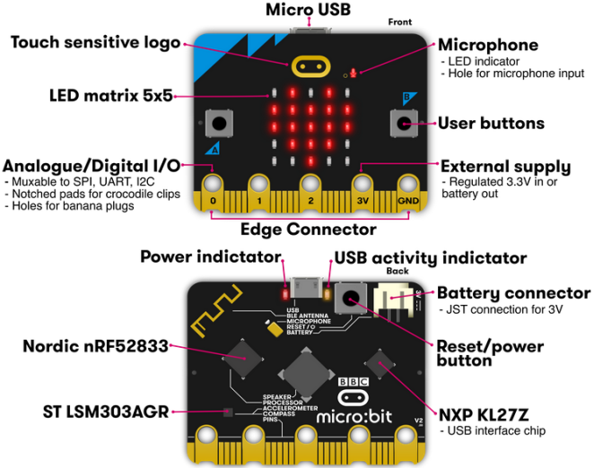

   Img

For more information,please resort to following links:

https://tech.microbit.org/hardware/

https://microbit.org/new-microbit/

https://www.microbit.org/get-started/user-guide/overview/

https://microbit.org/get-started/user-guide/features-in-depth/

**(3) Pin out**

|image37|

**Functions:**

+--------------+-------------------------------------------------------------------------------------+
| GPIO         | P0，P1，P2，P3，P4，P5，P6，P7，P8，P9，P10，P11，P12，P13，P14，P15，P16，P19，P20 |
+--------------+-------------------------------------------------------------------------------------+
| ADC/DAC      | P0，P1，P2，P3，P4，P10                                                             |
+--------------+-------------------------------------------------------------------------------------+
| IIC          | P19（SCL），P20（SDA）                                                              |
+--------------+-------------------------------------------------------------------------------------+
| SPI          | P13（SCK），P14（MISO），P15（MOSI）                                                |
+--------------+-------------------------------------------------------------------------------------+
| PWM（used    | P0，P1，P2，P3，P4，P10                                                             |
| frequently） |                                                                                     |
+--------------+-------------------------------------------------------------------------------------+
| PWM（not     | P5、P6、P7、P8、P9、P11、P12、P13、P14、P15、P16、P19、P20                          |
| frequently   |                                                                                     |
| used）       |                                                                                     |
+--------------+-------------------------------------------------------------------------------------+
| Occupied     | P3(LED Col3)，P4(LED Col1)，P5(Button A)，P6(LED Col4)，P7(LED Col2)，P10(LED       |
|              | Col5)，P11(Button B)                                                                |
+--------------+-------------------------------------------------------------------------------------+

Please browse the official website for mor
etails：\ https://tech.microbit.org/hardware/edgeconnector/

https://microbit.org/guide/hardware/pins/

**(4) Precautions for using Micro:bit motherboard:**

a. It is recommended to cover with a silicone protector to prevent short
circuit for its sophisticated electronic components.

b. Its IO port is very weak in driving since it can merely handle
current less than 300mA. Therefore, do not connect it with devices
operating in a large current, such as MG995 servo and DC motor or it
will get burnt. Furthermore, you must figure out the current
requirements of the devices before you use them and it is generally
recommended to use the board together with a Micro:bit expansion board.

c. It is recommended to power the main board via the USB interface or
the battery of 3V. The IO port of this board is 3V, so it does not
support sensors of 5V. If you need to connect sensors of 5 V, a Micro:
Bit expansion board is required.

d. When using pins(P3, P4, P6, P7 and P10)shared with the LED dot
matrix, blocking them from the matrix or the LEDs may display randomly
and the data about sensors connected maybe wrong.

e. Pin 19 and 20 can not be used as IO ports though the Makecode shows
they can. They can only be used as I2C communication.

f. The battery port of 3V cannot be connected with battery more than
3.3V or the main board will be damaged.

g. Forbid to operate it on metal products to avoid short circuit.

To put it simple, Micro:bit V2 main board is like a microcomputer, which
has made programming at our fingertips and enhanced digital innovation.
And as for programming environment, BBC provides a website:
https://microbit.org/code/, which has a graphical MakeCode program easy
for use.

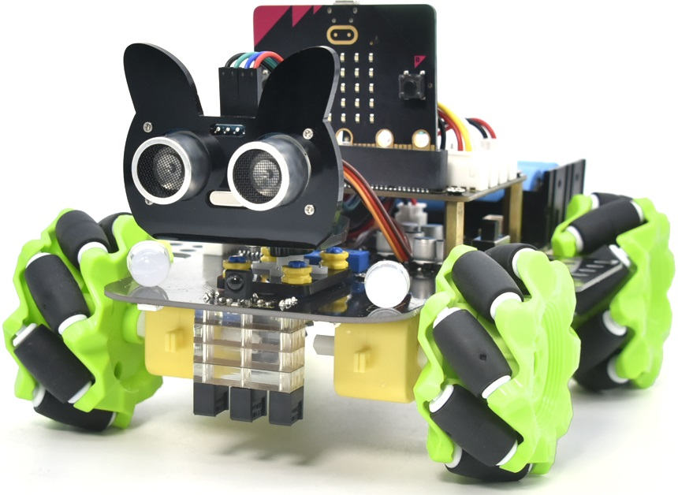
.. |image2| image:: ./media/Acrylic-1.png
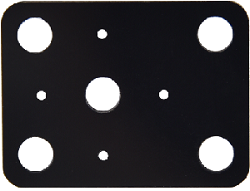
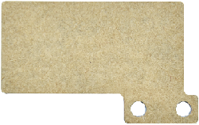
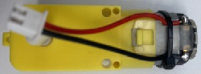
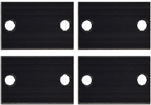
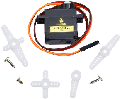
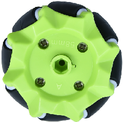
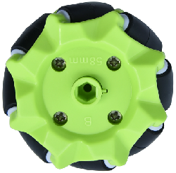
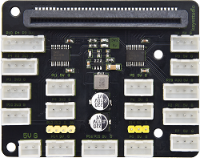
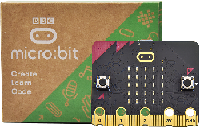
.. |image12| image:: ./mediaCar-Plate.png
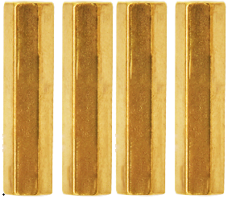
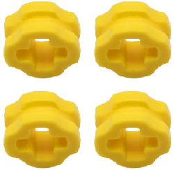
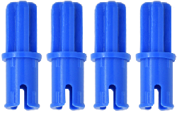
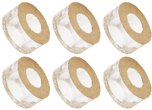
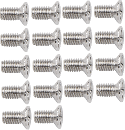
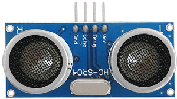
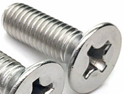
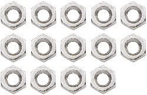
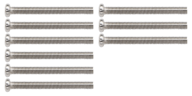
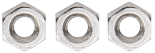
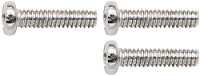
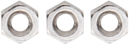
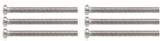
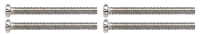

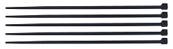
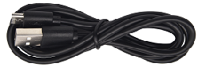
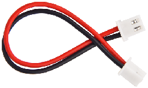
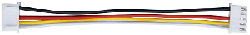
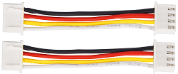
.. |image32| image:: ./media/4P-1.png
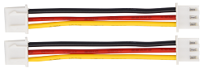
.. |image34| image:: ./media/Screwdriver.png
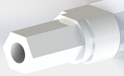
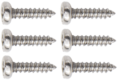
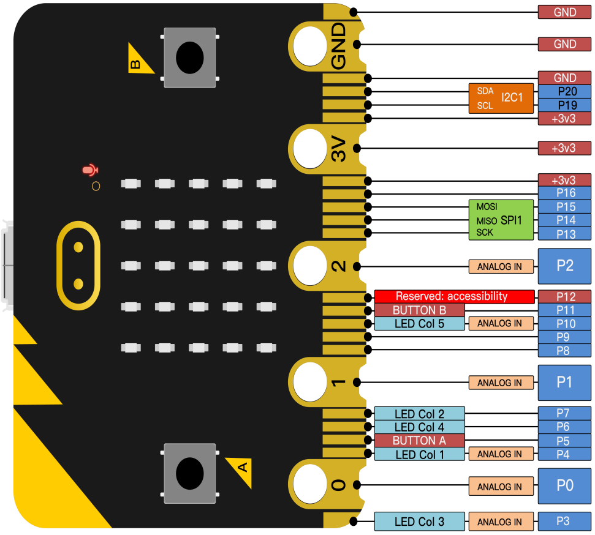
