2. Product installation
=======================

2.1 The Baseplate Assembly
--------------------------

Before you can build circuits, you’ll want to first assemble the
breadboard baseplate.

This keyestudio baseplate makes circuit building easier by keeping the
REV4 Board microcontroller and the breadboard connected without the
worry of disconnecting or damaging your circuit.

|image1|

1.To begin with, collect your parts: the REV4 Board, breadboard,
screwdriver, keyestudio baseplate and four baseplate screws.

|image2|

2.\ **Align the REV4 board** with its spot on the baseplate.

The text on it should face the same direction as the text on the
breadboard and the baseplate.Using four screws, affix the REV4 Board to
the four stand-off holes found on the baseplate.

|image3|

3.\ **Peel** the adhesive backing off the breadboard.

|image4|

4.\ **Carefully align** the breadboard over its spot on the baseplate.
The text on the breadboard should face the same direction as the text on
the baseplate. Firmly press the breadboard to the baseplate to adhere
it.

|image5|

Your baseplate is now assembled!

|image6|

After completing the above assembly, please first go and study Arduino
courses from Project 1 to Project 21. Continue with the following parts
only after finishing the previous courses.

**Be sure to complete Arduino Course Projects 1 through 21 before
proceeding to the installation section!!!**

2.2 ROBOT BASEPALTE ASSEMBLY
----------------------------

**Please complete Arduino projects 1 to 21 before proceeding with this
installation!!!**

Before you build this circuit, you’ll need to make a few modifications
to the breadboard baseplate to make it more robot-like!

1.Cut two more strips and weld the strips to the two motors.

Cut and attach two short pieces of dual-lock adhesive tape to your
motors. Be sure that your motors are mirror images of each other when
you attach the Dual Lock tape.

|image7|

|image8|

2.Press the motor to the baseplate, connecting the Dual Lock surfaces.
Try to get the motors as straight as possible so your robot will drive
straight.

|image9|

Make sure the Omni-directional wheel is firmly mounted on the Clear
Acrylic plate with the two screws and nuts.

|image10|

Then cut and attach a short piece of dual-lock adhesive tape to Acrylic
plate. Stick the two motors and Omni-directional wheel on the keyestudio
Baseplate.

|image11|

3.The bottom of your baseplate should look like the image. Remember that
the two motors should be mirror images of each other.

|image12|

4.Attach the wheels by sliding them onto the plastic shafts on the gear
motor. The shaft is flat on one side, as is the wheel coupler.

Align the two, and then press to fit the wheel onto the shaft.

|image13|

|image14|

5.The white part will act as a caster as the robot drives around.

|image15|

6.\ **Battery Holder Attachment:**\ Cut two pieces of Dual Lock. Remove
the adhesive backing, and attach one piece to the back of the battery
holder.

Adhere the second piece to the bottom of the baseplate, directly in the
middle. Press the battery holder to the baseplate so that the two pieces
of Dual Lock snap together.

Insert the batteries into the holder if you have not done so
already.Remember that batteries are polarized and can only go in one
way.

|image16|

Once you’re finished, it’s time to build the circuit.

|image17|

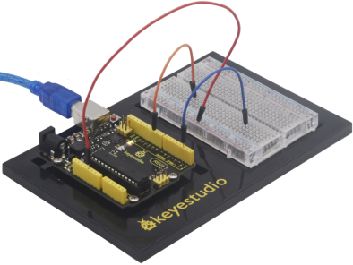
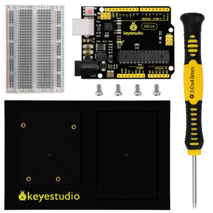
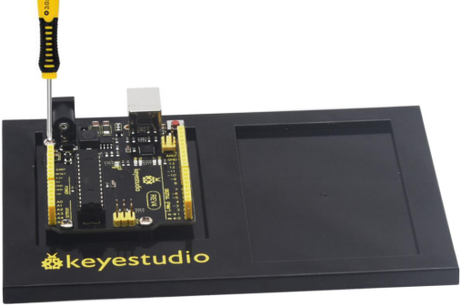
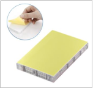
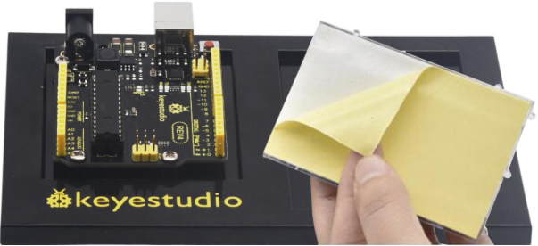
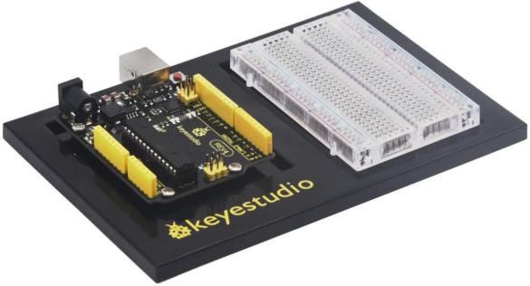
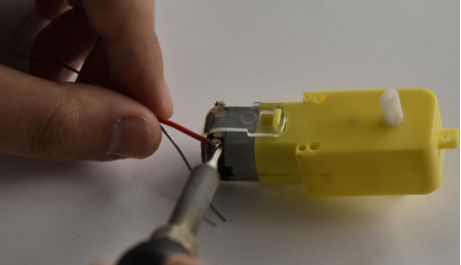
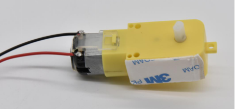
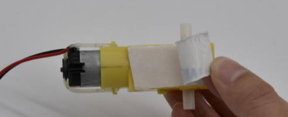
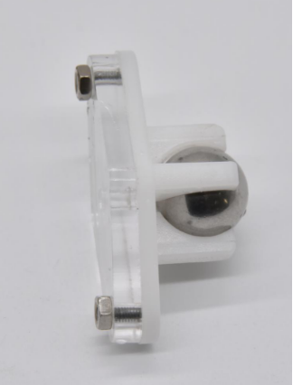
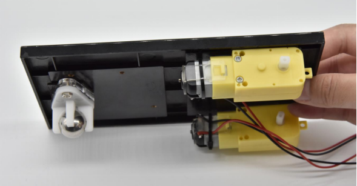
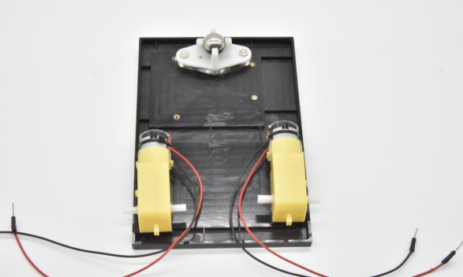
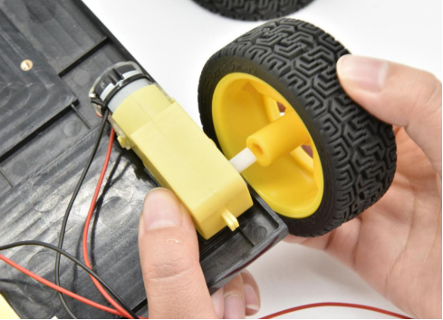
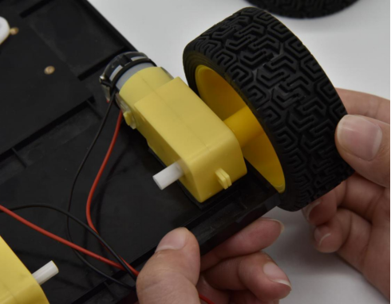
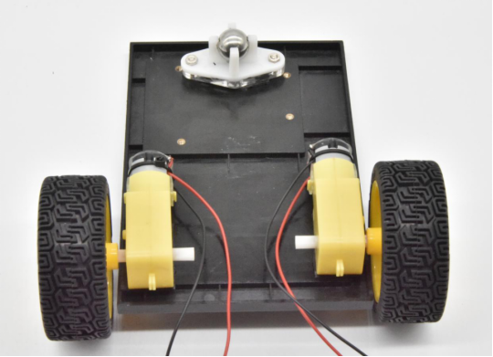
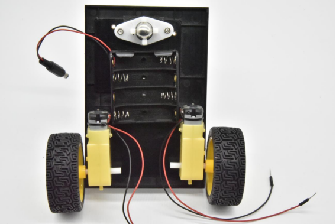
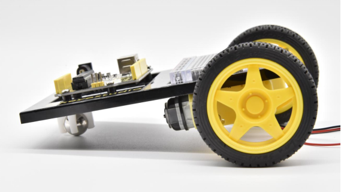
