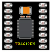
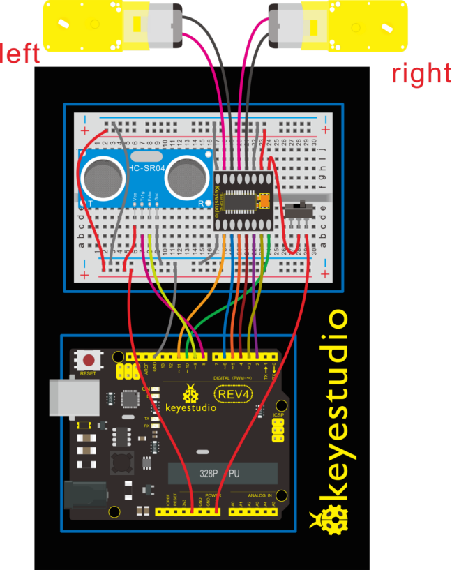
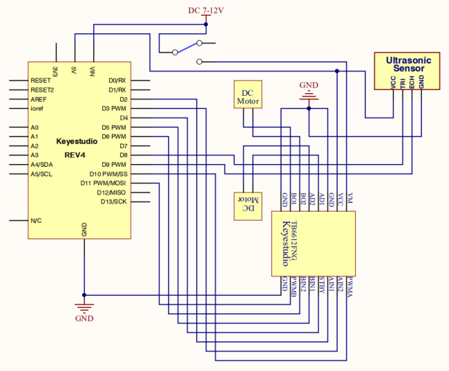
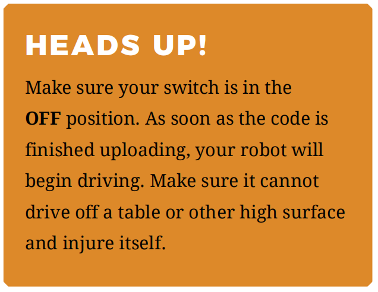
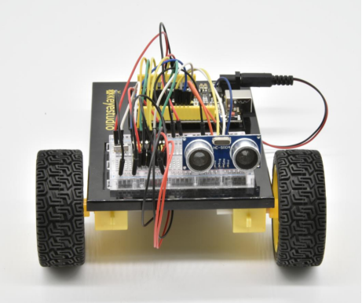
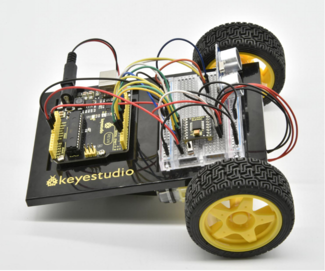

### Project 25 Ultrasonic Ranging Robot

**1.About this circuit**

In this circuit, you’ll control two motors and build your own obstacle avoidance robot! The robot that you will build uses a simple sensor to avoid obstacles.

**2.What You Need**

| Gear Motor x 2                         | TB6612FNG Motor Driver x 1 | Slide switch x 1                       | ultrasonic sensor x 1                  | Jumper wires x 25                      |
| -------------------------------------- | -------------------------- | -------------------------------------- | -------------------------------------- | -------------------------------------- |
|  |         |  |  |  |

**3.Hookup Guide**

Check out the circuit diagram and hookup table below to see how everything is connected.



**4.Circuit Diagram**



**5.Upload Code**

```
int AIN1=2;
int AIN2=3;
int STBY=4;
int BIN1=5;
int BIN2=6;
int PWMA=10;// enable pin 1
int PWMB=11;// enable pin 2
int pinTrip = 8;  //define ultrasonic ting pin to D12
int pinEcho = 9;   //define ultrasonic echo pin to D13
int Fspeed;
int Lspeed;
int Rspeed;

void setup()
{
  Serial.begin(9600);
  int i;
  for (i=2;i<=6;i++) // Ardunio motor driver module
  pinMode(i,OUTPUT); // set digital pins 2,3,4,5,6 as output
  pinMode(10,OUTPUT);// set digital pins 10, 11 as output
  pinMode(11,OUTPUT);
  pinMode(pinTrip,OUTPUT);
  pinMode(pinEcho,INPUT); 
}

void ask_pin_F()   // measure the front distance 
{
      digitalWrite(pinTrip, LOW);   //  make ultrasonic emit LOW voltage 2μs
      delayMicroseconds(2);
      digitalWrite(pinTrip, HIGH);  // make ultrasonic emit HIGH voltage 10μs，here at least 10μs
      delayMicroseconds(10);
      digitalWrite(pinTrip, LOW);    // make ultrasonic emit LOW voltage
      float Fdistance = pulseIn(pinEcho, HIGH);  // read the time difference
      Fdistance= Fdistance/5.8/10;       // turn time into distance （unit：cm） 
      Fspeed = Fdistance;              // read distance into Fspeedd(front speed)
      Serial.print("Fspeed = ");
      Serial.print(Fspeed );
      Serial.println("  cm");   
}

void loop() 
{      
      ask_pin_F();            // read the front distance
     if(Fspeed < 10)         //if front distance is less than 10cm       
     {
         stop();               // clear the output data 
         delay(100);
         back();                // backward 0.2 second
         delay(200);
     }
      
     if(Fspeed < 25)         //if front distance is less than25cm
     {
        stop(); 
        left(); 
        delay(200);             // clear the output data 
        ask_pin_F();            // read the front distance
        Lspeed = Fspeed; 
        right();
        delay(400);
        ask_pin_F();            //read the front distance 
        Rspeed = Fspeed; 
          
        if(Lspeed > Rspeed)   //if left speed is greater than right speed
        {
            left();
            delay(400);
            front();
        }
        
        if(Lspeed <= Rspeed)   //if left speed is less than or equal to right speed
        {
        	front();
        } 
        
        if (Lspeed < 10 && Rspeed < 10)   //if both left and right side distance are less than 10cm
        {
         	back();      //go back        
        }          
     }
     else                      //if front distance is within 25cm     
     {
       front();     
     }     
}

void front() 
{
    digitalWrite(STBY,HIGH);
    digitalWrite(AIN1,HIGH);
    digitalWrite(AIN2,LOW);
    analogWrite(PWMA,200);
    digitalWrite(BIN1,HIGH); 
    digitalWrite(BIN2,LOW);
    analogWrite(PWMB,200);
}

void back() 
{
    digitalWrite(STBY,HIGH);
    digitalWrite(AIN1,LOW);
    digitalWrite(AIN2,HIGH);
    analogWrite(PWMA,200); 
    digitalWrite(BIN1,LOW);
    digitalWrite(BIN2,HIGH);
    analogWrite(PWMB,200); 
}

void stop() 
{
  digitalWrite(STBY,LOW);
}

void left() 
{
    digitalWrite(STBY,HIGH);
    digitalWrite(AIN1,HIGH);
    digitalWrite(AIN2,LOW);
    analogWrite(PWMA,200); 
    digitalWrite(BIN1,LOW);
    digitalWrite(BIN2,HIGH);
    analogWrite(PWMB,200); 
}

void right() 
{
    digitalWrite(STBY,HIGH);
    digitalWrite(AIN1,LOW);
    digitalWrite(AIN2,HIGH);
    analogWrite(PWMA,200); 
    digitalWrite(BIN1,HIGH); 
    digitalWrite(BIN2,LOW);
    analogWrite(PWMB,200); 
}
```

The robot that you will build uses a simple sensor to avoid obstacles. Keep in mind that the ultrasonic distance sensor needs a clear path to avoid unwanted interruptions in your robot’s movements. Keep the distance sensor clear of any wires from your circuit.



**6.Result**

When the switch is turned off, the robot will sit still. When the switch is turned on, the robot will drive forward until it senses an object. When it senses an object in its path, it will reverse and then turn to avoid the obstacle.



