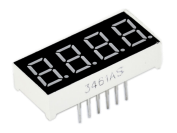
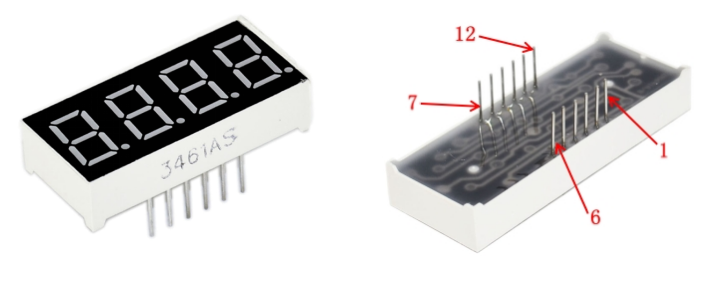
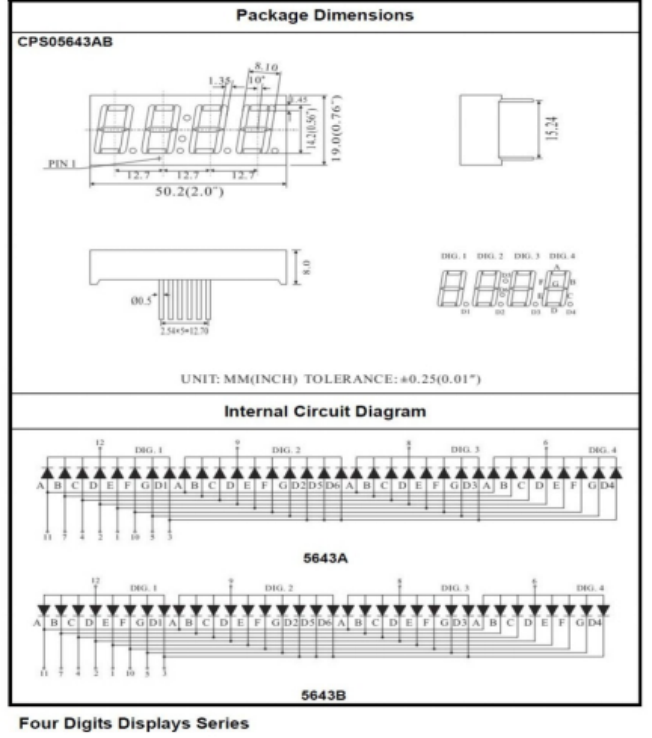
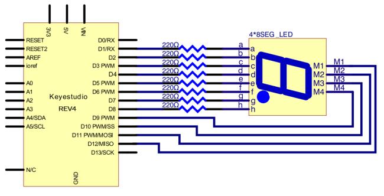
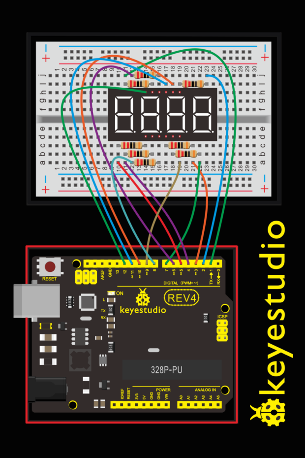
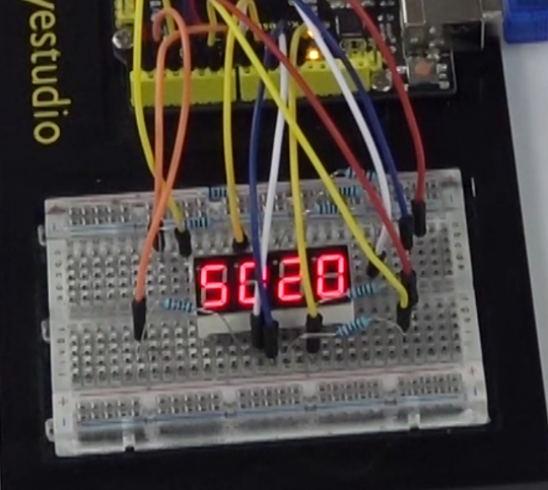

### Project 9 4-Digit Segment Display

**1.About this circuit**

In this lesson, you will learn how to use a 4-digit 7-segment display. We make the display show changing numbers among 0000-9999.

**2.What You Need**

| REV4 Baseplate                         | 4-digit 7-seg Display x 1              | 220Ω Resistor x 8 | Jumper wires x 12 | USB cable x 1    |
| -------------------------------------- | -------------------------------------- | ----------------- | ----------------- | ---------------- |
|  |  |   |   |  |

**3.Component Introduction**



LED segment display is a semiconductor light-emitting device. Its basic unit is a light-emitting diode (LED). The display features one decimal point per digit. The hardware interface is twelve (two rows of six) through-hole pins, counting from 1 to 12 anticlockwise.

**4.Manual for LED segment display**



**5.Hookup Guide**

Check out the circuit diagram and hookup table below to see how everything is connected.





**6.Upload Code**

```
int a = 1;
int b = 2;
int c = 3;
int d = 4;
int e = 5;
int f = 6;
int g = 7;
int dp = 8;

int d4 = 9;
int d3 = 10;
int d2 = 11;
int d1 = 12;

// set variable
long n = 1230;
int x = 100;
int del = 55;    // fine adjustment for clock

void setup()
{
  pinMode(d1, OUTPUT);
  pinMode(d2, OUTPUT);
  pinMode(d3, OUTPUT);
  pinMode(d4, OUTPUT);
  pinMode(a, OUTPUT);
  pinMode(b, OUTPUT);
  pinMode(c, OUTPUT);
  pinMode(d, OUTPUT);
  pinMode(e, OUTPUT);
  pinMode(f, OUTPUT);
  pinMode(g, OUTPUT);
  pinMode(dp, OUTPUT);
}
/////////////////////////////////////////////////////////////
void loop()
{
  int a=0;
  int b=0;
  int c=0;
  int d=0;
  unsigned long currentMillis = millis();
  while(d>=0)
  {
     while(millis()-currentMillis<10)
     {
       Display(1,a);
       Display(2,b);
       Display(3,c);
       Display(4,d);
     }
     currentMillis = millis(); 
     d++;  
     if (d>9) 
     {
       c++;
       d=0;
  	 }
     if (c>9) 
     {
       b++;
       c=0;
     }
     if (b>9) 
     {
       a++;
       b=0;
     }
     if (a>9) 
     {
       a=0;
       b=0;
       c=0;
       d=0;
     }
   }  
}
///////////////////////////////////////////////////////////////
void WeiXuan(unsigned char n)//
{
  switch (n)
  {
    case 1:
      digitalWrite(d1, LOW);
      digitalWrite(d2, HIGH);
      digitalWrite(d3, HIGH);
      digitalWrite(d4, HIGH);
      break;
    case 2:
      digitalWrite(d1, HIGH);
      digitalWrite(d2, LOW);
      digitalWrite(d3, HIGH);
      digitalWrite(d4, HIGH);
      break;
    case 3:
      digitalWrite(d1, HIGH);
      digitalWrite(d2, HIGH);
      digitalWrite(d3, LOW);
      digitalWrite(d4, HIGH);
      break;
    case 4:
      digitalWrite(d1, HIGH);
      digitalWrite(d2, HIGH);
      digitalWrite(d3, HIGH);
      digitalWrite(d4, LOW);
      break;
    default :
      digitalWrite(d1, HIGH);
      digitalWrite(d2, HIGH);
      digitalWrite(d3, HIGH);
      digitalWrite(d4, HIGH);
      break;
  }
}

void Num_0()
{
  digitalWrite(a, HIGH);
  digitalWrite(b, HIGH);
  digitalWrite(c, HIGH);
  digitalWrite(d, HIGH);
  digitalWrite(e, HIGH);
  digitalWrite(f, HIGH);
  digitalWrite(g, LOW);
  digitalWrite(dp, LOW);
}

void Num_1()
{
  digitalWrite(a, LOW);
  digitalWrite(b, HIGH);
  digitalWrite(c, HIGH);
  digitalWrite(d, LOW);
  digitalWrite(e, LOW);
  digitalWrite(f, LOW);
  digitalWrite(g, LOW);
  digitalWrite(dp, LOW);
}

void Num_2()
{
  digitalWrite(a, HIGH);
  digitalWrite(b, HIGH);
  digitalWrite(c, LOW);
  digitalWrite(d, HIGH);
  digitalWrite(e, HIGH);
  digitalWrite(f, LOW);
  digitalWrite(g, HIGH);
  digitalWrite(dp, LOW);
}

void Num_3()
{
  digitalWrite(a, HIGH);
  digitalWrite(b, HIGH);
  digitalWrite(c, HIGH);
  digitalWrite(d, HIGH);
  digitalWrite(e, LOW);
  digitalWrite(f, LOW);
  digitalWrite(g, HIGH);
  digitalWrite(dp, LOW);
}

void Num_4()
{
  digitalWrite(a, LOW);
  digitalWrite(b, HIGH);
  digitalWrite(c, HIGH);
  digitalWrite(d, LOW);
  digitalWrite(e, LOW);
  digitalWrite(f, HIGH);
  digitalWrite(g, HIGH);
  digitalWrite(dp, LOW);
}

void Num_5()
{
  digitalWrite(a, HIGH);
  digitalWrite(b, LOW);
  digitalWrite(c, HIGH);
  digitalWrite(d, HIGH);
  digitalWrite(e, LOW);
  digitalWrite(f, HIGH);
  digitalWrite(g, HIGH);
  digitalWrite(dp, LOW);
}

void Num_6()
{
  digitalWrite(a, HIGH);
  digitalWrite(b, LOW);
  digitalWrite(c, HIGH);
  digitalWrite(d, HIGH);
  digitalWrite(e, HIGH);
  digitalWrite(f, HIGH);
  digitalWrite(g, HIGH);
  digitalWrite(dp, LOW);
}

void Num_7()
{
  digitalWrite(a, HIGH);
  digitalWrite(b, HIGH);
  digitalWrite(c, HIGH);
  digitalWrite(d, LOW);
  digitalWrite(e, LOW);
  digitalWrite(f, LOW);
  digitalWrite(g, LOW);
  digitalWrite(dp, LOW);
}
void Num_8()
{
  digitalWrite(a, HIGH);
  digitalWrite(b, HIGH);
  digitalWrite(c, HIGH);
  digitalWrite(d, HIGH);
  digitalWrite(e, HIGH);
  digitalWrite(f, HIGH);
  digitalWrite(g, HIGH);
  digitalWrite(dp, LOW);
}

void Num_9()
{
  digitalWrite(a, HIGH);
  digitalWrite(b, HIGH);
  digitalWrite(c, HIGH);
  digitalWrite(d, HIGH);
  digitalWrite(e, LOW);
  digitalWrite(f, HIGH);
  digitalWrite(g, HIGH);
  digitalWrite(dp, LOW);
}
void Clear()    // clear the screen
{
  digitalWrite(a, LOW);
  digitalWrite(b, LOW);
  digitalWrite(c, LOW);
  digitalWrite(d, LOW);
  digitalWrite(e, LOW);
  digitalWrite(f, LOW);
  digitalWrite(g, LOW);
  digitalWrite(dp, LOW);
}

void pickNumber(unsigned char n)// select number
{
  switch (n)
  {
    case 0: Num_0();

      break;
    case 1: Num_1();
      break;
    case 2: Num_2();
      break;
    case 3: Num_3();
      break;
    case 4: Num_4();
      break;
    case 5: Num_5();
      break;
    case 6: Num_6();
      break;
    case 7: Num_7();
      break;
    case 8: Num_8();
      break;
    case 9: Num_9();
      break;
    default: Clear();
      break;
  }
}

void Display(unsigned char x, unsigned char Number)//    take x as coordinate and display number
{
  WeiXuan(x);
  pickNumber(Number);
  delay(1);
  Clear() ; // clear the screen
}
```

**7.Result**

Hookup well and upload the code to board, the 4-digit LED display will show the jumping number among 0000-9999.

