3.1 Data download
~~~~~~~~~~~~~~~~~

Please note: The library files and code used by Arduino are available
for download only at this location. No further download options will be
provided thereafter.

Data download: :download:`Arduino Data <./Arduino.zip>`

3.2 Software Download
~~~~~~~~~~~~~~~~~~~~~

When you get the control board, first you should install the Arduino
software and driver.

You can see all the Arduino software versions from the link below:
https://www.arduino.cc/en/Main/OldSoftwareReleases#1.5.x

Or you can browse the ARDUINO website at this link,
https://www.arduino.cc, pop up the following interface.

|image1|

Then click the SOFTWARE on the browse bar, you will have two options
ONLINE TOOLS and DOWNLOADS.

|image2|

Click DOWNLOADS, it will appear the latest software version of ARDUINO
1.8.5 shown as below.

|image3|

In this software page, on the right side you can see the version of
development software for different operating systems. So ARDUINO has a
rather powerful compatibility. You should download the software that is
compatible with the operating system of your computer.

In our project, we will take WINDOWS system as an example here. There
are also two options under Windows system, one is installed version, the
other is non-installed version.

For simple installed version, first click Windows Installer, you will
get the following page.

.. figure:: media/87d68bf0f659efd12d5a2421f3b0985b.jpeg
   :alt: operating system

   operating system

|image4|

This way you just need to click JUST DOWNLOAD, then click the downloaded
file to install it.

For non-installed version, first click Windows ZIP file, you will also
get the pop-up interface as the above figure.

Click JUST DOWNLOAD, and when the ZIP file is downloaded well to your
computer, you can directly unzip the file and then click the icon of
ARDUINO program to start it.

**Installing Arduino (Windows)**

Install Arduino with the exe. Installation package.

.. figure:: media/0410a9a2e63c51fee1d04b59041a2884.jpeg
   :alt: Arduino Setup 1

   Arduino Setup 1

Click **“I Agree”** to see the following interface.

.. figure:: media/7bbc90969d7a44f397e0d63428e87c82.jpeg
   :alt: Arduino Setup 2

   Arduino Setup 2

Click **“Next”**. Pop up the interface below.

.. figure:: media/567d62b3dfce772c3e969c653651f6ad.jpeg
   :alt: Arduino Setup 3

   Arduino Setup 3

You can press Browse… to choose an installation path or directly type in
the directory you want.

Then click “Install” to initiate installation.

.. figure:: media/69d2c16b683d24d8c03109c853905f97.jpeg
   :alt: Arduino Setup 4

   Arduino Setup 4

Wait for the installing process, if appear the interface of Window
Security, just continue to click Install to finish the installation.

.. figure:: media/4201c1f8cfe13dad71fac63ae275820c.png
   :alt: Arduino1.5.6- setup 5

   Arduino1.5.6- setup 5

All right, up to now, you have completed the Arduino setup! The
following icon will appear on your PC desktop.

.. figure:: media/2fbd15be3868df7eb1654b0981c34f79.png
   :alt: software

   software

Double-click the icon of Arduino to enter the desired development
environment shown as below.

|Arduino 1.8.5| **Open Arduino IDE**

In the previous, we have introduced the Arduino installation. So this
time let’s first have basic understanding of the ARDUINO development
environment. After that, you will learn how to upload the program to
Arduino board.

First of all, open the unzipped folder of ARDUINO development software
and click icon of ARDUINO to open the software, as the figure shown
below.

.. figure:: media/2c82284035d2ecf2f07f2f05f01255d6.png
   :alt: arduino 5

   arduino 5

**Build Projects**

When open the Arduino software, you will have two options as below:

- Build a new project

- Open an exiting project example

If you want to build a new project, please select “File”→then click
“New”, you will see the software interface as follows.

|image5|

If you want to open an example project, please select
**File→Example→Basics→Blink** shown below.

|image6|

**Select Arduino Board**

On the Arduino software, you should click *Tools→Board* , select the
correct board. Here in our tutorial we should select Arduino Uno. Shown
as below.

**arduino 1-8-5 board**

**Select Serial Port**

If you are not sure which port is correct, at first directly open the
Control Panel of your computer, then click to open **Device Manager**,
you can check the COM port here. Shown as below.

|image7|\ |arduino 1-8-5 port| Then you should click **Tools→Serial
Port.** It may be COM3 or higher (COM1 and COM2 are usually reserved as
hardware serial port).

**Upload the Code to Your Board**

Before showing you how to upload the code to your board, you can check
the function of each icon on the Tool bar of Arduino IDE listed below:

.. figure:: media/29f46713e687c2599b13e9f612d39bc9.png
   :alt: IDE

   IDE

+-----------------------------------------+----------------------------+
| **IDE 1** **Verify/Compile**            | Check the code for errors  |
+=========================================+============================+
| **IDE 2** **Upload**                    | Upload the current Sketch  |
|                                         | to the Arduino             |
+-----------------------------------------+----------------------------+
| **IDE 3** **New**                       | Create a new blank Sketch  |
+-----------------------------------------+----------------------------+
| **IDE 4** **Open**                      | Show a list of Sketches    |
+-----------------------------------------+----------------------------+
| **IDE 5** **Save**                      | Save the current Sketch    |
+-----------------------------------------+----------------------------+
| **IDE 6** **Serial Monitor**            | Display the serial data    |
|                                         | being sent from the        |
|                                         | Arduino                    |
+-----------------------------------------+----------------------------+

3.3 Project(1)
--------------

Project 1: Light up LED
-----------------------

**Introduction**

let’s get started from a more basic program, lighting up the LED. Here
we will use our keyestudio EASY plug white Piranha LED module. |KS0353
1| **Wiring Diagram**

The wiring is pretty simple. You can connect the EASY plug Piranha LED
module to the `KETBOT control
board <http://wiki.keyestudio.com/index.php/Ks0350_Keyestudio_KEYBOT_Coding_Robot_Control_Board>`__
using only an RJ11 cable.

|image8|

Hookup as the above diagram, next we will show the first program to
light up the LED module, making LED on for one second then off for one
second, repeatedly.

**Test Code 1**

::

   /*
       keyestudio KEYBOT Education Robot
       Project 1
       Light up LED
       http//www.keyestudio.com
       */
       int ledpin=11; // define the LED pin as Digital 11

       void setup() 
       {  
       pinMode(11, OUTPUT); // initialize digital pin 11 as an output.
       }

       void loop() 
       {  
       digitalWrite(11, HIGH);   // turn the LED on (HIGH is the voltage level)  
       delay(1000);              // wait for a second  
       digitalWrite(11, LOW);    // turn the LED off by making the voltage LOW  
       delay(1000);              // wait for a second
       }

**Test Result**

When upload well the code to the board, you will see the status at the
bottom show “Upload success! ”. And the LED on the module lights up for
one second, then off for one second, repeatedly. Congrats! The first
program is completed successfully.

Project 2: LED Brightness Controlled by PWM
-------------------------------------------

**Introduction**

In the previous lesson, you have learned how to turn on or off the LED.
Furthermore, you may be interested in changing the brightness of LED
light, just like your bedside lamp.

It is indeed important for you to master the knowledge of PWM. PWM is
short for Pulse Width Modulation. How can it be understood in a simple
way? We all know that the voltage output of Arduino Digital port only
has two states, LOW and HIGH, corresponding to the voltage output of 0V
and 5V. If merely make use of LOW and HIGH state, it cannot control the
brightness of an LED light.

However, if convert the voltage output of 0 Volts and 5 Volts into the
value within 0-255, this way you can change the value within 0-255 to
control the brightness of light. It is much more feasible, right?

Pulse Width Modulation, or PWM, is a technique for getting analog
results with digital means. Digital control is used to create a square
wave of different duty cycle, a signal switched between on and off. This
on-off pattern can simulate voltages in between full on (5 Volts) and
off (0 Volts) by changing the portion of the time the signal spends on
versus the time that the signal spends off.

The Arduino UNO has totally 6 PWM outputs, which are Digital 3, 5, 6, 9,
10 and 11.These PWM pins can be used as Digital output or Analog output.

.. figure:: media/54ef6da144b4531dd9ada686a7e67c56.GIF
   :alt: pwm

   pwm

PWM can be applied to lots of applications, like dimming lamps, motor
speed, sound production, etc.

In the following, you will learn how to control the light brightness?

Firstly, you can connect the EASY plug Piranha LED module to KETBOT
coding control board with only a 6P6C RJ11 cable. In fact, it works on
either D11 or D9-D10 connector. (If connecting the D11 to test the LED,
D9-D10 cannot be used.)

Wiring Diagram

Below is a wiring diagram used to control the LED brightness.

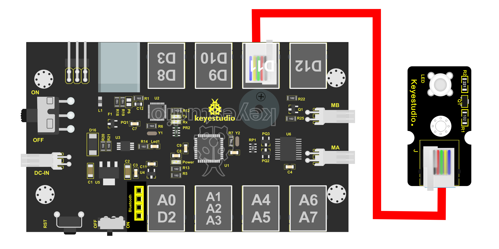

   KS0353 1

**Test Code 2**

::

       int LED= 11;            //define the LED pin 
       int i = 0;                   //define a variable i，
       void setup(){
       pinMode(LED,OUTPUT);       //set LED pin as OUTPUT
       }
       void loop(){
       for(i = 0;i < 255;i++){    //variable is changed from 0 to 254（fade in）
           analogWrite(LED, i);     //set LED brightness
           delay(10);               //delay 10ms, analogWrite function will be finished in a short time. 
                                   //speed is too fast to observe                           
       }
       for(i =255;i > 0; i--){    //variable is changed from 255 to 1（fade out）
           analogWrite(LED, i);    //set LED brightness
           delay(10);              //delay 10ms
       }
       }

Can be used to light a LED at varying brightnesses or drive a motor at
various speeds. After a call to analogWrite(), the pin will generate a
steady square wave of the specified duty cycle until the next call to
analogWrite() (or a call to digitalRead() or digitalWrite()) on the same
pin.

The frequency of the PWM signal on most pins is approximately 490 Hz.

**Phenomenon Show**

Furthermore, in the motor driving project below, it also involves the
PWM.

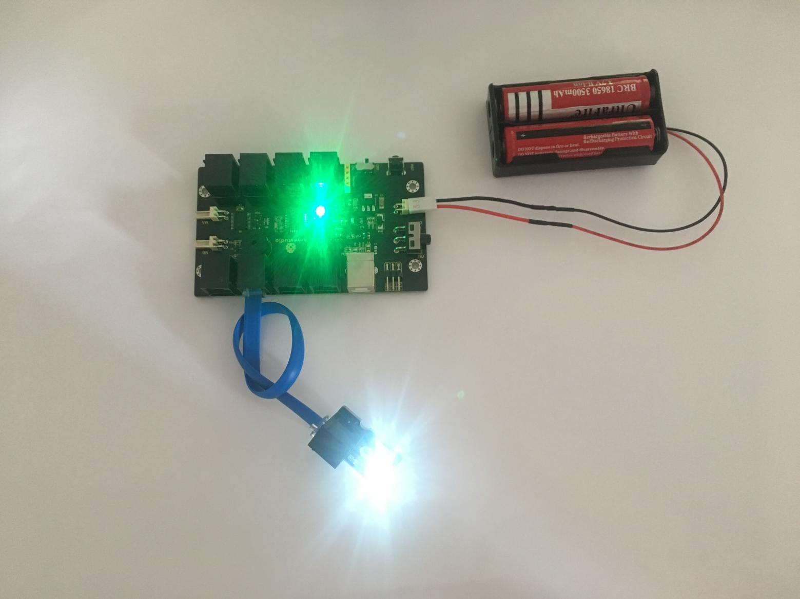

   ks0353- result 1

Project 3: KEYBOT Line Tracking Robot
-------------------------------------

Principle and Application of Line Tracking Sensor

**Introduction**

The tracking sensor is actually an infrared sensor. The component used
here is the TCRT5000 infrared tube. Its working principle is to use the
different reflectivity of infrared light to the color, then convert the
strength of the reflected signal into a current signal. During the
process of detection, black is active at HIGH level, but white is active
at LOW level. And detection height is 0-3 cm.

The following figure is our `KEYBOT 3-channel line tracking
module <http://wiki.keyestudio.com/index.php/KS0352_Keyestudio_KEYBOT_Programmable_Robot_3-way_Line_Tracking_Sensor>`__.
We have integrated 3 sets of TCRT5000 infrared tube on a single board,
pretty convenient for wiring and controlling.

By rotating the adjustable potentiometer on the sensor, it can adjust
the detection sensitivity of the sensor. The sensitivity is the best
when the S1, S2 and S3 are adjusted to make the LEDs between on and off
state.

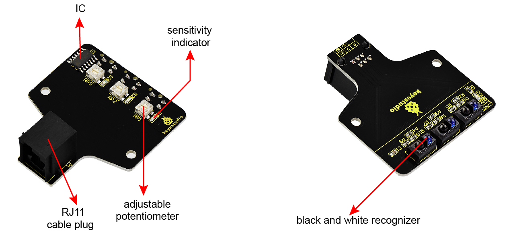

   KEYBOT tracking sensor

**Parameters**

- Operating Voltage: DC 5V

- Interface: RJ11 connector

- Output Signal: 3-channel digital signal

- Detection Height: 0-3cm

**Wiring Diagram**

Okay, next let’s do a simple test for this tracking module. Connect the
KEYBOT 3-channel line tracking sensor to the plug A1-A2-A3 of control
board. Then connect the white Piranha LED module to the plug D9. When
the sensor of any channel detects a white object, a LED on the module
will light up.

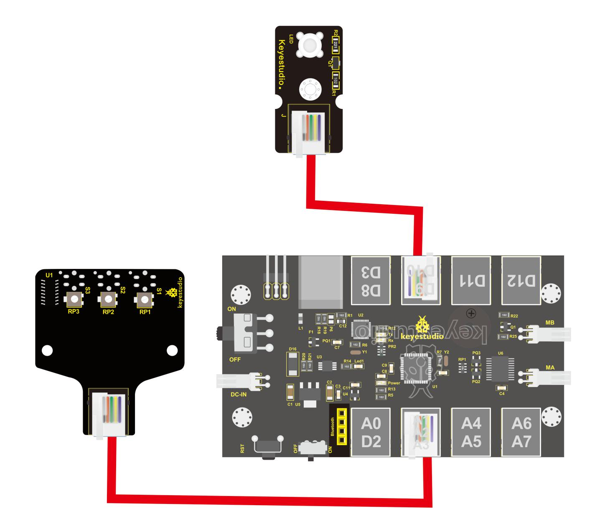

   KS0353 2

**Test Code 3**

::

       const int LED1 = 9;  // define the pin D9 for controlling LED1
       const int LED2 =11;  // define the pin D11 for controlling LED2 
       const int LED3 = 12;  // define the pin D12 for controlling LED3
       const int S1 = A1;   // define the S1 line tracking sensor as pin A1
       const int S2 = A2;   //  define the S2 line tracking sensor as pin A2 
       const int S3 = A3;   // define the S3 line tracking sensor as pin A3

       void setup() 
       {
       pinMode(LED1,OUTPUT);   // set the LED pin as OUTPUT state
       pinMode(LED2,OUTPUT);
       pinMode(LED3,OUTPUT);
       pinMode(S1,INPUT);    //  set the line tracking sensor pin as INPUT state 
       pinMode(S2,INPUT);
       pinMode(S3,INPUT);
       }

       void loop() 

       {
       if( digitalRead(S1)==LOW)  // read the state of sensor, if detects a white paper, it is LOW.
       {
       digitalWrite(LED1, HIGH);  //turn LED on
       }
       else // or else
       {
           digitalWrite(LED1, LOW); // turn LED off
       }
       if( digitalRead(S2)==LOW)  
       {
       digitalWrite(LED2, HIGH);  
       }
       else  
       {
           digitalWrite(LED2, LOW); 
       }
       if( digitalRead(S3)==LOW) 
       {
       digitalWrite(LED3, HIGH);   
       }
       else 
       {
           digitalWrite(LED3, LOW);
       }
       }

**Test Result**

Upload well the code to the board, if pick up a white object close to
the tracking module, you should see the white LED module light up. Shown
below.

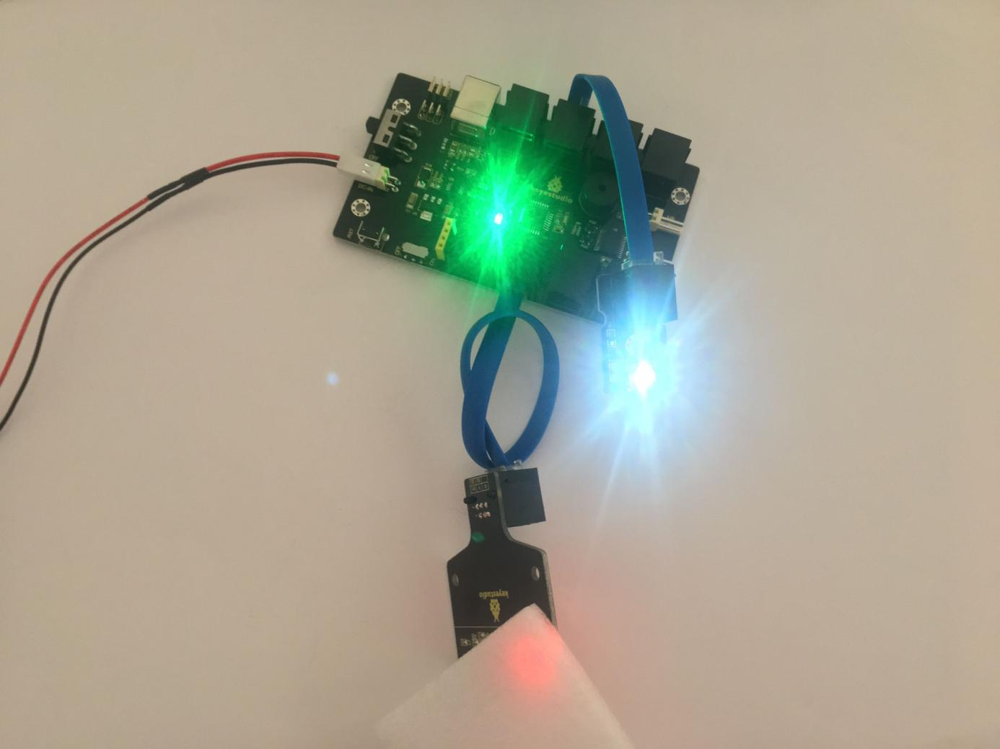

   ks0353- result 2

Project 4: Motor Driving and Speed Control
------------------------------------------

**Introduction**

The Keyestudio KEYBOT Coding Control Board is particularly designed for
car robot control.

This control board has integrated the UNO R3 control board and a motor
driver into one circuit board, which can directly drive two DC motors.

For the convenience of car design, this control board comes with a
Bluetooth interface (fully compatible with HC-06 Bluetooth module), 2
servo interfaces and a passive buzzer.

For easy car control, this control board also comes with 2 slide
switches and a reset button. The large slide switch is used for an
external power supply control. While the small switch is used for the
serial port communication of Bluetooth module.

For simple connection, it extends all the digital and analog ports out
as RJ11 sockets. It also comes with a power interface. The RJ11 socket
integrates the digital and analog ports together, so you just need a
cable to connect it with sensor modules, pretty simple and convenient.

**Specifications**

- Main control chip: ATMEGA328P-AU
- Motor drive chip: TB6612FNG
- USB to serial chip: ATMEGA16U2-MU
- Input voltage: DC 7-12V
- Motor drive current: 1.2A (ave) / 3.2A (peak)
- Standby current: 47mA
- Comes with a passive buzzer: D13 control
- Motor direction interface: D4 (motor A) and D7 (motor B)
- Motor speed interface: D5 (motor A) and D6 (motor B)
- Comes with 2 slide switches: power control switch (large one) and
  Bluetooth serial communication control switch (small one)
- Comes with a Bluetooth interface: suitable for HC-06 Bluetooth, fixed
  direction, can not be connected if reversed.
- Comes with 2 servo interfaces: D9 and D10 control respectively
- Comes with a reset button
- Comes with a power input interface
- 2 DC motor connection interfaces (labeled MA and MB)
- It has 8 RJ11 sockets for external sensors and modules (internal with
  power interface). The control terminals are: D3 and D8, D9 and D10,
  D11, D12, D2 and A0, A1 A2 and A3, A4 and A5, A6 and A7.

**Elements and Interfaces**

Here is an explanation of what every element and interface of the board
does:

**KS0350 -pinouts**

**Driving DC Motor**

In the previous section, we have introduced the basic parameters and
interfaces of KETBOT control board. After that, let’s connect the
control board to drive the two DC motors.

**KS0353 3**\ Note that the motor with longer lead is connected to the
connector MB, so another motor with short lead is connected to MA.

Well, it is time to create the sketch.

The code logic of the KEYBOT is nothing more than 5 kinds of movement
modes, namely go forward, go backward, turn left, turn right and stop.
So think about it. How could it implement those functions?

Simply, for example, both left and right motor of KEYBOT turn forward,
so the robot is able to go forward. If both the left and right motor
turn reverse, KEYBOT robot will go backward.

Besides, if the left motor turns forward but right motor turns reverse,
KEYBOT will turn right. If the right motor turns forward but left motor
turns reverse, KEYBOT will turn left.

So how to control the forward and backward of motor? Actually, you can
easily achieve that by controlling the microcontroller pin for motor
direction to be HIGH or LOW level.

It is much more easier to understand the motor rotation, however, it
would be a little bit complicated to work out the speed control of
motor.

As for the speed control of motor, it involves the PWM mode. So what is
PWM? Actually PWM is the short for Pulse Width Modulation. PWM is a
technique for getting analog results with digital means. Digital control
is used to create a square wave (a signal switched between on and off)
to control the analog output.

The output voltage of Arduino Digital port has only LOW and HIGH level

**PWM analog output**

.. figure:: media/54ef6da144b4531dd9ada686a7e67c56.GIF
   :alt: pwm

   pwm

The digital output pin **PIN#4** and **PIN#7** control the two motors
direction, that is, forward and backward rotation. The analog output pin
**PIN#5** and **PIN#6** control the motor’s speed.

+----------+-----------+-----------+---------------+-----------+-----------+--------------+
|          | **PIN#5** | **PIN#4** |               | **PIN#6** | **PIN#7** |              |
+==========+===========+===========+===============+===========+===========+==============+
| Forward  | 200       | HIGH      | Motor A goes  | 200       | HIGH      | Motor B goes |
|          |           |           | forward       |           |           | forward      |
+----------+-----------+-----------+---------------+-----------+-----------+--------------+
| Backward | 200       | LOW       | Motor A goes  | 200       | LOW       | Motor B goes |
|          |           |           | backward      |           |           | backward     |
+----------+-----------+-----------+---------------+-----------+-----------+--------------+
| Left     | 200       | LOW       | Motor A goes  | 200       | HIGH      | Motor B goes |
|          |           |           | backward      |           |           | forward      |
+----------+-----------+-----------+---------------+-----------+-----------+--------------+
| Right    | 200       | HIGH      | Motor A goes  | 200       | LOW       | Motor B goes |
|          |           |           | forward       |           |           | backward     |
+----------+-----------+-----------+---------------+-----------+-----------+--------------+
| Stop     | 0         | LOW       | Motor A stops | 0         | LOW       | Motor B      |
|          |           |           |               |           |           | stops        |
+----------+-----------+-----------+---------------+-----------+-----------+--------------+

**Test Code 4**

::

       const int PWMA = 5;  // define the speed of left motor as pin D5
       const int PWMB = 6;  // define the speed of right motor as pin D6
       const int INT_A = 4;  // define the left motor control pin D4
       const int INT_B = 7;  // define the right motor control pin D7
       void setup() 
       {  
       pinMode(PWMA,OUTPUT);  // set the motor control pin as OUTPUT state
       pinMode(PWMB,OUTPUT);
       pinMode(INT_A,OUTPUT);
       pinMode(INT_B,OUTPUT);
       }
       void loop() 
       {
       digitalWrite(INT_A,HIGH);  // left motor turns forward
       digitalWrite(INT_B,HIGH);   //right motor turns forward
       analogWrite(PWMA,200);   // speed of left motor（PWM=200)
       analogWrite(PWMB,200);   //  speed of right motor（PWM=200)
       delay(2000);
       analogWrite(PWMA,0);   //  speed of left motor（PWM=0)
       analogWrite(PWMB,0);   //  speed of right motor（PWM=0)
       delay(2000);
       digitalWrite(INT_A,LOW);   // left motor turns reverse
       digitalWrite(INT_B,LOW);  // right motor turns reverse
       analogWrite(PWMA,200);   // speed of left motor（PWM=200)
       analogWrite(PWMB,200);   //speed of right motor（PWM=200)
       delay(2000);
       analogWrite(PWMA,0);   //speed of left motor（PWM=0)
       analogWrite(PWMB,0);   //speed of right motor（PWM=0)
       delay(2000);
       }

**Test Result**

Done uploading the code to the board, connect two external DC motors to
the board, then power it with DC 7-12V. Turn on the larger slide switch
on the board, finally you should see the two motors turn forward for 1
second, stop for 1 second and then reverse for 1 second, stop for 1
second, repeatedly.

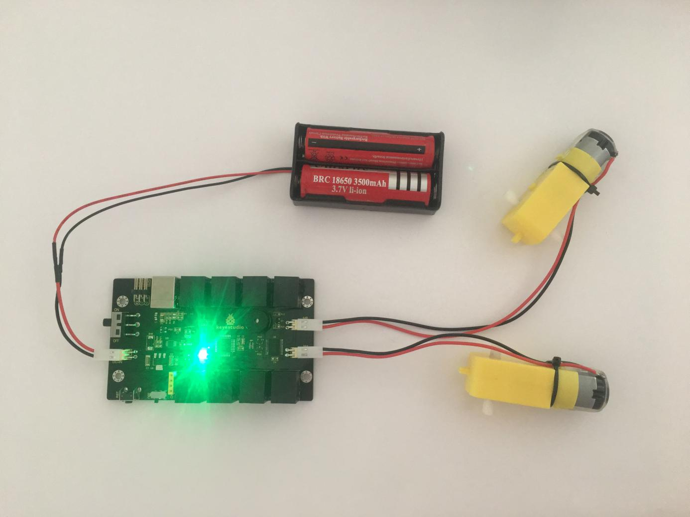

   ks0353- result 3

Project 5: KEYBOT Line Following
--------------------------------

**Introduction**

In the previous sections, you have learned the principles and
applications of both line tracking module and motor driving. After that,
combine the tracking sensor and control board to build a line following
KEYBOT.

So at first what does line tracking mean? It refers to follow the line
trajectory. You might often see some robots always follow or track the
black line.

The principle is using the tracking sensor to detect the black track on
the pavement, and detection signal will feed back to the main control
board. Then main control board will analyze and judge the collected
signals to control and drive the motor in time, thus can adjust KEYBOT
turning direction. That is why the KEYBOT can automatically follow the
black track, achieving the automatic line tracking function.

This technology has been applied to many areas such as driverless
vehicles, unmanned factories, warehouses, and service robots.

**Project Principle**

Using the characteristic that black has low reflectivity to light. When
flat surface is not black, the infrared light transmitted by the sensor
will be reflected back mostly, so the sensor outputs LOW level 0.

When the flat surface has a black line and the sensor is over the black
line, the reflected infrared light is very less due to the weak
reflectivity of black, so it does not reach the action level and sensor
outputs HIGH level 1.

Use the main control board to determine whether the output end of sensor
is 0 or 1, finally detect the black line. The main control board will
control the turning direction of motor according to the received signal.
This is a simple line tracking KEYBOT.

**Wiring Diagram**

Connect the tracking sensor, two motors and battery to the control board
as follows.

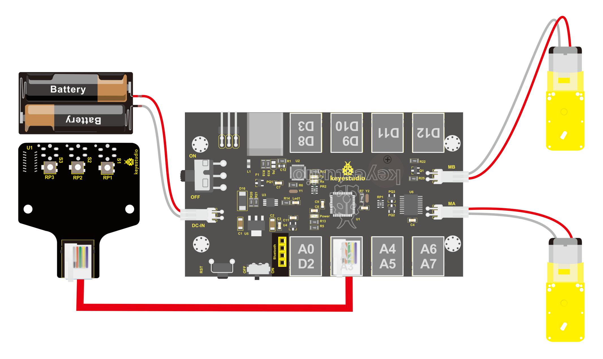

   KS0353 4

**Write the Code**

Wire it up well as the above diagram. Okay, let’s move on to write the
test code. Think about the code logic.

There are two kinds of tracking sensor’s states as follows:

1. If the middle tracking sensor detects a black line, the robot will go
   forward.

2. The middle tracking sensor does not detect a black line. If the left
   sensor detects a white line, and the right sensor detects a black
   line, the robot will turn right. On the contrary, if the right sensor
   detects a white line, and the left one detects a black line, the
   robot will turn left. If three sensors all detect a white line, it
   will stop.

Well, figure out the logic, then combine with the example code of motor
driving mentioned in the above section, you can have a try to write out
the code logic of line tracking.

**Test Code 5**

::

   const int PWMA = 5;  // define the left motor pin D5
       const int PWMB = 6;  // define the right motor pin D6
       const int INT_A = 4;  // define the left motor speed pin D4
       const int INT_B = 7;  // define the right motor speed pin D7

       const int S1 = A1;   // define the right tracking sensor pin as A1
       const int S2 = A2;   // define the middle tracking sensor pin as A2
       const int S3 = A3;   // define the left tracking sensor pin as A3
       int s1,s2,s3;      // 3 variables, used to save the value (0 or 1) read by tracking sensor.

       void setup() 
       {
       Serial.begin(9600);    // set the serial port baud rate to 9600
       pinMode(PWMA,OUTPUT);   // set the motor control pin as OUTPUT state 
       pinMode(PWMB,OUTPUT);   
       pinMode(INT_A,OUTPUT);
       pinMode(INT_B,OUTPUT);

       pinMode(S1,INPUT);    // set the tracking sensor pin as INPUT state 
       pinMode(S2,INPUT);
       pinMode(S3,INPUT);

       }

       void loop() 
       {
       s1 = digitalRead(S1); // assign the digital value read from pin S1，S2,S3 to s1,s2,s3
       s2 = digitalRead(S2);
       s3 = digitalRead(S3);

       if(s2==1)  //if pin s2 detects a black line 
       {
           front();   // go forward
       }

       else  // s2 not detect a black line
       {
       if(s3==1&&s1==0)  // if s3 detects a black line  
           {
           left();     // turn left
           }
           else if(s3==0&&s1==1)  //s1 detects a black line
           {
           right();    // turn right
           }
           else  // not detect a black line
           {
           Stop();      // stop
           }
       }

       }
       // forward
       void front()    
       {
       digitalWrite(INT_A,HIGH);  // left motor turns forward 
       digitalWrite(INT_B,HIGH);   // right motor turns forward 
       analogWrite(PWMA,80);   // speed of left motor（PWM=80)
       analogWrite(PWMB,80);   // speed of right motor（PWM=80)
       }
       // backward
       void back()   
       {
       digitalWrite(INT_A,LOW);   // left motor turns reverse
       digitalWrite(INT_B,LOW);  // right motor turns reverse 
       analogWrite(PWMA,80);   // speed of left motor（PWM=80)
       analogWrite(PWMB,80);   // speed of right motor（PWM=80)
       }
       // turn left 
       void left()   
       {
       digitalWrite(INT_A,LOW);  //  left motor turns reverse
       digitalWrite(INT_B,HIGH);  //  right motor turns forward 
       analogWrite(PWMA,80);   // speed of left motor（PWM=80)
       analogWrite(PWMB,80);   // speed of right motor （PWM=80)
       }
       // turn right
       void right()   
       {
       digitalWrite(INT_A,HIGH);   //  left motor turns forward 
       digitalWrite(INT_B,LOW);   //  right motor turns reverse
       analogWrite(PWMA,80);   // speed of left motor（PWM=80)
       analogWrite(PWMB,80);   // speed of right motor（PWM=80)
       }
       // stop
       void Stop()    
       {
       digitalWrite(INT_A,LOW);
       digitalWrite(INT_B,LOW);
       analogWrite(PWMA,0);  // speed of left motor （PWM=0)
       analogWrite(PWMB,0);  //speed of right motor（PWM=0)
       }

**Test Result**

Done uploading the code to the board, then power it with DC 7-12V. Turn
on the larger slide switch on the board, and draw a black line on the
ground, the KEYBOT will follow the black line.

|image9|

Project 6: KEYBOT Avoiding Obstacles
------------------------------------

Principle and Application of Ultrasonic Module

|image10|

**Introduction**

There is an animal called bat in nature. The bats can fly at night, not
depend on its eyes, but on its ears and vocal organs. When the bat
flies, it will emit a scream, an ultrasonic signal that humans cannot
hear because of its high audio frequency. If these ultrasonic signals
hit other objects on the flight path, they will be reflected back
immediately. After receive the returned information, the bats complete
the whole process of listening, seeing, calculating and bypassing
obstacles during the flutter.

The principle of the ultrasonic rangefinder module is as the same as the
above principle. The ultrasonic module will emit the ultrasonic waves
after trigger signal. When the ultrasonic waves encounter the object and
are reflected back, the module outputs an echo signal, so it can
determine the distance of object from the time difference between
trigger signal and echo signal. Ultrasonic sensor has a wide range of
sensitivity, no blind area, and no interference with obstacles.

As the following picture shown, it is our KEYBOT ultrasonic module. It
has two somethings like eyes. One is transmitting end, the other is
receiving end.

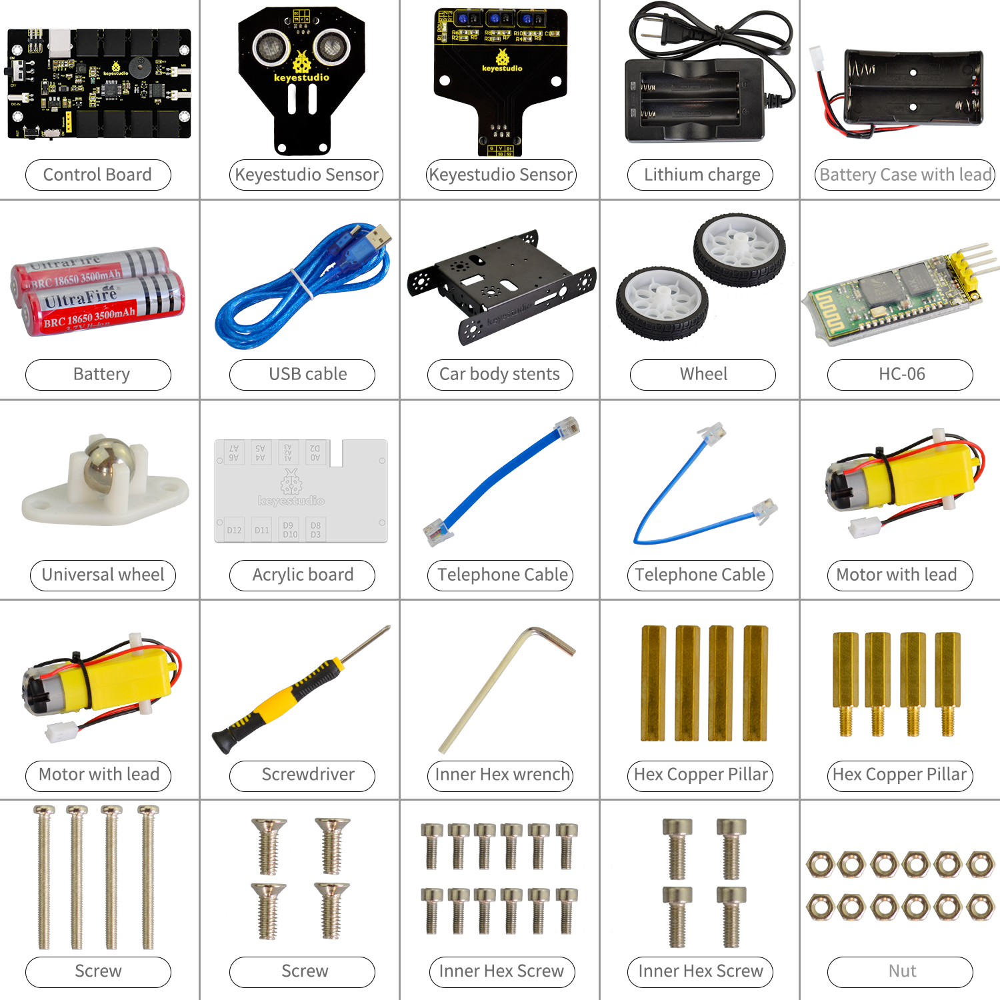

   清单

**Parameters**

- Operating Voltage: 5V（DC）

- Operating Current: 15mA

- Operating Frequency: 40khz

- Maximum Detection Distance: 3-5m

- Minimum Detection Distance: 3-4cm

- Sensing Angle: less than 15 degrees

**Hookup Guide**

Connect the ultrasonic module to the control board with only a 6P6C RJ11
cable. Shown as below.

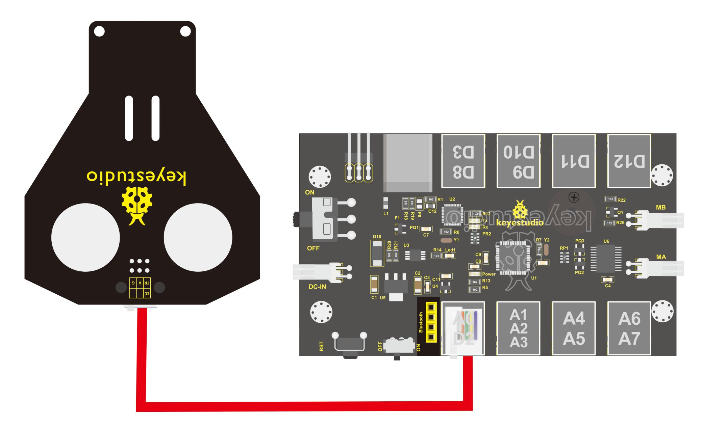

   KS0353 5

**【Notice:】**

1. Must first connect the ultrasonic module and then power up.

2. Measurement period is better at more than 60ms. To prevent the impact
   of the transmitted signal to the echo signal.

**When using it:**

(1) Use IO trigger ranging, at least 10us HIGH level signal; that is,
    first pull the Trip Low, then give a HIGH level signal of 10us.

(2) The module automatically sends eight square waves of 40khz to
    automatically detect whether there is a signal return back;

(3) There is a signal return, through the IO output a High level, and
    the duration period of High level is the time of Ultrasonic wave
    from emission to return.

Test distance = (High level time \* speed of sound (340M/S))/2;

Then you can get the distance formula: detection distance = (High level
time/58) (cm);

**Test Code 6**

::

       int pinTrip=A0; // connect to SR04 Trip, give more than 10us High level
       int pinEcho=2; // connect to Echo,  the time to receive the High level
       float distance=0; // save the distance
       void setup() {
       // put your setup code here, to run once:
       pinMode(pinTrip,OUTPUT);
       pinMode(pinEcho,INPUT);
       Serial.begin(9600);
       }
       void loop() {
       // put your main code here, to run repeatedly.
       digitalWrite(pinTrip,LOW);
       delayMicroseconds(2); // pull down level 
       digitalWrite(pinTrip,HIGH);
       delayMicroseconds(12);// give 12us HIGH level
       digitalWrite(pinTrip,LOW);// pull down level 
       distance=pulseIn(pinEcho,HIGH);// check the HIGH level time
       delay(10);
       distance=distance/58; // get the distance 
       Serial.print("distance=");
       Serial.print(distance);
       Serial.println("cm");
       delay(500);
       }

**Test Result**

|image11|

Hook it up and upload well the code to main board, then open the serial
monitor, and set the baud rate to 9600. When ultrasonic sensor detects
an obstacle ahead, on the monitor you should see the distance between
the sensor and an obstacle, displaying every 0.5 second.

Project 7: KEYBOT Avoiding Obstacle
-----------------------------------

Introduction

It is rather not suitable for human to work in some relatively harsh
environments. At this moment, if we have a robot that can shuttle freely
in such environments, then how good should it be!

Based on this original intention, our team develop this KEYBOT that be
able to automatically avoid an obstacle when running on complicated
terrain.

This project is a simple and automatic obstacle avoidance system based
on KETBOT control board. The smart robot with KEYBOT control board as
the core, makes use of ultrasonic module to detect the obstacle ahead,
and the detection signal will feed back to the control board.

The control board will then analyze and judge the collected signals to
control the motor driving in time, thus adjust the KEYBOT direction.
Finally control the KEYBOT automatically avoid an obstacle ahead to run
forward smoothly.

**Project Principle**

1. Use the ultrasonic module to detect the distance between the KEYBOT
   and obstacle ahead.

2. KEYBOT control board will control the motor’s rotating direction
   according to the distance value measured by ultrasonic sensor between
   KEYBOT and an obstacle.

3. When the measured distance between ultrasonic sensor and obstacle
   ahead is greater than 25cm, KEYBOT goes forward. If less than 25cm,
   KEYBOT turns left, and detects the distance between sensor and
   obstacles, then KEYBOT turns right, and detects the distance between
   sensor and obstacles.

When the left distance is greater than the right distance, KEYBOT will
turn left. Otherwise, it turns right.

**Hookup Guide**

Connect the ultrasonic module to control board with only an RJ11 cable.
And separately connect two motors and batteries to the board. Shown as
below.

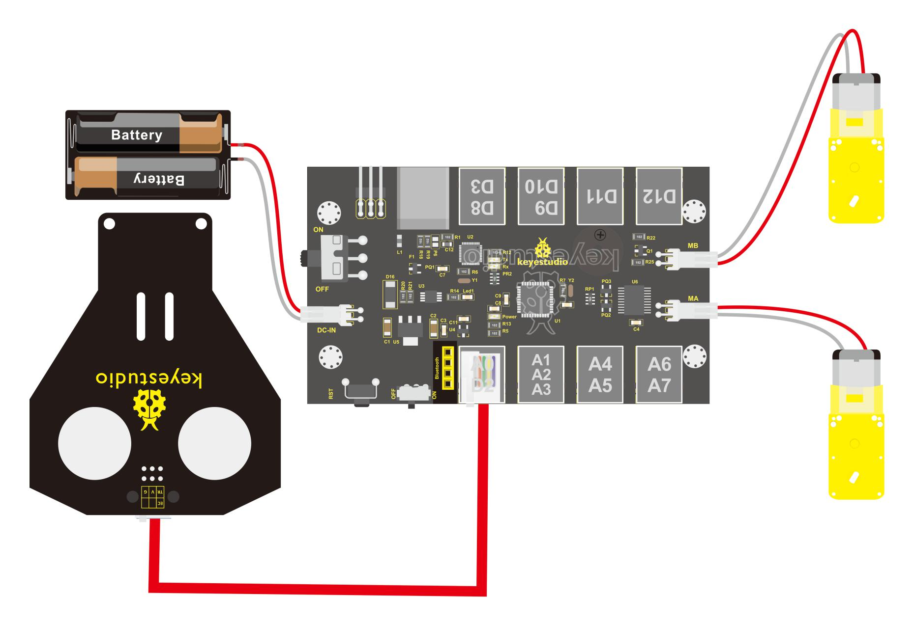

   KS0353 6

**Test Code 7**

::

   #include<SR04.h>      // include the ultrasonic libraries 
       const int ting = A0;   // define the pin ting of ultrasonic sensor as A0
       const int echo = 2;   // define the pin echo of ultrasonic sensor as D2
       SR04 sr04 = SR04(echo,ting);   // build the ultrasonic sr04
       long a,a1,a2;     // define the variable a, used to save the measured distance from ultrasonic sensor.

       const int PWMA = 5;  // define the speed of left motor as pin D5
       const int PWMB = 6;  // define the speed of right motor as pin D6
       const int INT_A = 4;  // define the speed of left motor as pin D4
       const int INT_B = 7;  // define the speed of right motor as pin D7

       const int S = 13;  // define the buzzer pin as D13

       void setup() 
       {
       Serial.begin(9600);   // set the serial port baud rate to 9600
       pinMode(PWMA,OUTPUT);  // set the control pin of motor as OUTPUT
       pinMode(PWMB,OUTPUT); 
       pinMode(INT_A,OUTPUT);
       pinMode(INT_B,OUTPUT);
       pinMode(S,OUTPUT);  // set the control pin of buzzer to OUTPUT
       }

       void loop() 
       {
       a=sr04.Distance();    // detect the distance and assign to a
       Serial.print(a);     // print the a value on serial monitor
       Serial.println("cm"); // print the character cm and line wrap
       delay(10);   //delay 100ms
       if(a<25)     // if the measured distance is less than 25cm
       {
           buzzer();  // buzzer beeps
           Stop();   // stop
           delay(1000);
           left();
           delay(430);
           Stop();
           a1 = sr04.Distance();    //detect the distance and assign to a1
           delay(1000);
           right();
           delay(820);
           Stop();
           a2 = sr04.Distance();    // detect the distance and assign to a2
           delay(1000);
           if(a1>a2)
           {
           left();
           delay(820);
           front();
           }
           else
           {
           front();
           }
       }
       else   // The measured distance is greater than or equal to 25
       {
           front();  // go forward
       }
       }

       // go forward
       void front()    
       {
       digitalWrite(INT_A,HIGH);  //left motor turns forward
       digitalWrite(INT_B,HIGH);   // right motor turns forward
       analogWrite(PWMA,100);   // speed of left motor（PWM=100)
       analogWrite(PWMB,100);   // speed of right motor（PWM=100)
       }
       // backward 
       void back()   
       {
       digitalWrite(INT_A,LOW);   // left motor turns backward
       digitalWrite(INT_B,LOW);  // right motor turns backward
       analogWrite(PWMA,100);   //speed of left motor（PWM=100)
       analogWrite(PWMB,100);   // speed of right motor（PWM=100)
       }
       // turn left
       void left()   
       {
       digitalWrite(INT_A,LOW);  // left motor turns backward
       digitalWrite(INT_B,HIGH);  // right motor turns forward 
       analogWrite(PWMA,80);   // speed of left motor（PWM=80)
       analogWrite(PWMB,80);   // speed of right motor（PWM=80)
       }
       // turn right
       void right()   
       {
       digitalWrite(INT_A,HIGH);   // left motor turns forward 
       digitalWrite(INT_B,LOW);   // right motor turns backward
       analogWrite(PWMA,80);   // speed of left motor（PWM=80)
       analogWrite(PWMB,80);   // speed of right motor（PWM=80)
       }
       // stop
       void Stop()    
       {
       digitalWrite(INT_A,LOW);
       digitalWrite(INT_B,LOW);
       analogWrite(PWMA,0);  // speed of left motor（PWM=0)
       analogWrite(PWMB,0);  // speed of right motor（PWM=0)
       }
       // buzzer
       void buzzer()
       {
           for(int i=0;i<50;i++)
           {
           digitalWrite(S,HIGH);
           delay(1);
           digitalWrite(S,LOW);
           delay(1);
           }
           delay(50);
           for(int i=0;i<50;i++)
           {
           digitalWrite(S,HIGH);
           delay(1);
           digitalWrite(S,LOW);
           delay(1);
           }
       }

**Test Result**

Done uploading the code to the board, then power it with DC 7-12V. Turn
on the larger slide switch on the board, if place an obstacle in front
of the KEYBOT, it can automatically avoid an obstacle ahead to run.

|image12| ## Project 8: Bluetooth Controlled KEYBOT

Principle and Application of Bluetooth Remote Control

Introduction

Bluetooth, as the name implies, blue teeth, and is not used to bite
people, but a wireless data transmission method. Bluetooth technology is
a wireless standard technology that enables short-range data exchange
among fixed devices, mobile devices, and personal area networks of
buildings (UHF radio waves in the ISM band of 2.4 to 2.485 GHz).

There are two kinds of commonly used Bluetooth module on the market,
HC-05 and HC-06 models. The difference between them is that the HC-05 is
a master-slave one. It can not only make small reports to its own
“master”, but also can receive the command given to it.

The HC-06 can only work in slave mode, which can only accept the
superior command. For instance, in many cases you may want to be an
overbearing man, letting the subordinates obey the order without any
nonsense. So in such situation, it is enough to use the HC-06 module
shown as below.

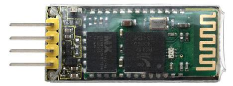

   hc-06

**Parameters**

- Bluetooth Protocol: Bluetooth 2.1+ EDR Standard

- USB Protocol: USB v1.1/2.0

- Operating Frequency: 2.4GHz ISM Frequency Band

- Modulation Mode: Gauss Frequency Shift Keying

- Transmit Power: ≤ 4dBm, Second Stage

- Sensitivity: ≤-84dBm at 0.1% Bit Error Rate

- Transmission Speed: 2.1Mbps(Max)/160
  kbps(Asynchronous)；1Mbps/1Mbps(Synchronous)

- Safety Feature: Authentication and Encryption

- Supported Configuration: Bluetooth Serial Port (major and minor)

- Supply Voltage: DC 5V

- Operating Temperature: -20℃ to 55℃

**Wiring Diagram**

Next, we are going to do a small experiment. When Bluetooth module
receives a signal sent by phone, control the LED module on and off.
First of all connect the LED module and battery to control board, and
then directly plug the Bluetooth module into the Bluetooth header.

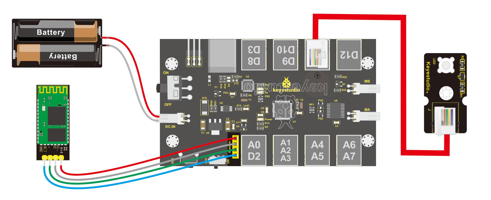

   KS0353 7

**Test Code 8**

::

       int val;  
       int led=11;
       void setup() 
       { 
       Serial.begin(9600);
       pinMode(11,OUTPUT);
       }
       void loop()
       { val=Serial.read(); 
       if(val=='a')
       { 
       digitalWrite(11, HIGH);   // turn the LED on (HIGH is the voltage level)
       }
       if(val=='b')
       { 
       digitalWrite(11, LOW);    // turn the LED off by making the voltage LOW
       }}

After wiring, upload the above code to the board, and connect well the
Bluetooth module. Pay more attention to the connecting direction of
Bluetooth module. Plug it correctly and you should see an LED on the
module flash.

**Pay special attention to:**

You must first upload the code to the board and then plug in the
Bluetooth module, otherwise the program fails to compile. Because the
data transmits of Bluetooth module will occupy the microcontroller’s TX
and RX pins that are also used for the code upload of microcontroller,
it exists a conflict.

|image13|

After uploading the code, you have to do another thing, that is, install
an application of Bluetooth serial assistant on the phone. You can click
the icon to download it or click here:

https://drive.google.com/open?id=1D16V4HZ5H6k7p1-NMCqb0JRy_dl5tvuC

The Bluetooth we used here is Bluetooth 2.0. Currently, it only supports
the Android devices. Do not support Apple devices. Please pay attention
to this when using it.

After the serial assistant is installed, we must first connect the
device, open the mobile Bluetooth, search for a Bluetooth device. If
find a Bluetooth device named HC-06, pair and enter 1234, finally you
should see the paired device shown as below.

|BTClient|\ |bluetooth-1|

Then open the Bluetooth serial communication APP, namely BT Client, and
connect well the Bluetooth just paired.

Done connecting, an LED on the Bluetooth module is always on. If enter
the letter *a* on the Bluetooth APP, the LED connected on the pin 11 is
on; if enter the letter *b*, the LED will be off.

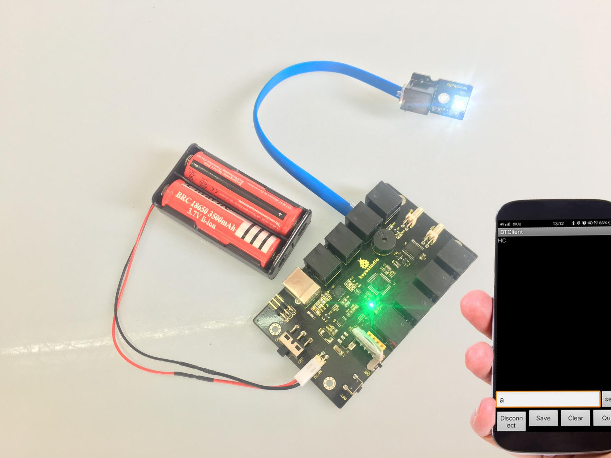

   q

Project 9: Bluetooth Controlled KEYBOT
--------------------------------------

Introduction

In the previous section, you have learned the principles of Bluetooth
and how to use Bluetooth to control a small light. Okay, based on that,
could we use Bluetooth to send a command to control the KEYBOT run?
Absolutely yeah. In the previous section, we can use a mobile APP to
send a character. Use a Bluetooth module to receive the Bluetooth signal
from the mobile phone, and feed it back to the main control board. Then
main control board will analyze and judge the collected signals. If
correct, it will control the KEYBOT run.

|image14|

Here we don’t need a Bluetooth serial assistant as mentioned above. Just
use an Android APP developed by our keyestudio team to control the
KEYBOT.

You can click the icon to download it or clink here:

https://drive.google.com/open?id=1g-bwP1SyJVfQseywRORQ6rOJOVd3JU5i

The interface of this APP is very simple, as shown below.

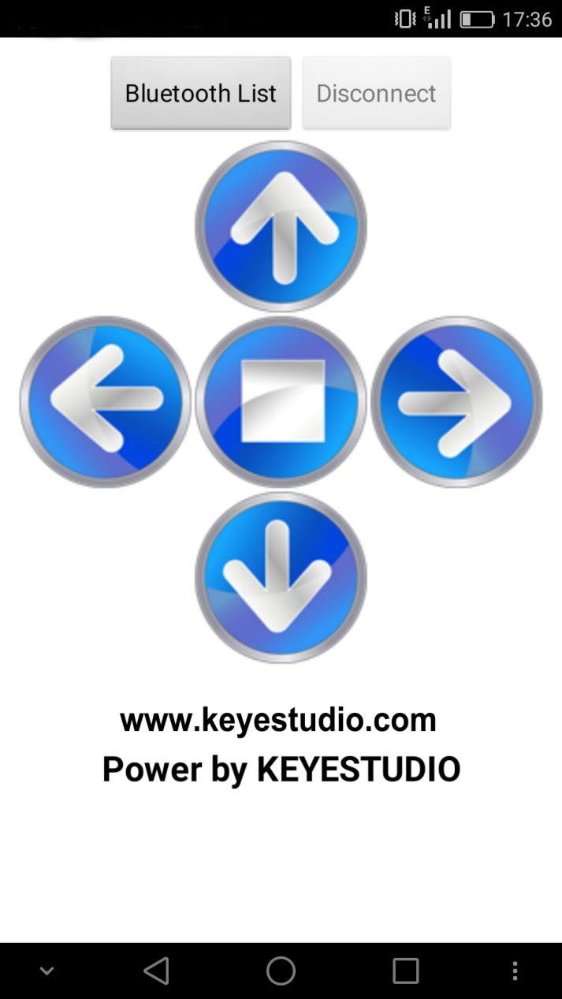

   Bluetooth

Connected the Bluetooth, let’s make use of a little program that can
read the serial data, to check what character the five buttons send so
that apply them to the example code of Bluetooth KEYBOT in the following
projects.

**Test Code 9**

::

   char val;// define the variable val
       void setup()
       {
       Serial.begin(9600);// set the baud rate as 9600. When connecting the particular device like Bluetooth, it should be consistent with the baud rate of other devices.  
       }
       void loop()
       {
       val=Serial.read();//read the data received from serial port, and assign it to val
       Serial.println(val);// print val data
       delay(300);//delay 0.3S
       }

From the above program test, you can know that the five buttons are
Upward (“U”), Downward (“D”), Left (“L”), Right (“R”), and Stop (“S”).

The principle is very simple. When Bluetooth module receives these
characters sent by mobile phone, and then it will send them to ARDUINO.
ARDUINO will control the rotation direction of motor according to the
preset value in the code. When receive the information “U”, KEYBOT moves
forward. When receive “D”, KEYBOT goes backward. If receive “L”, KEYBOT
turns left. If receive “R”, KEYBOT turns right. The KEYBOT will stop
when receiving the “S”.

**Hookup Guide**

Refer to the connection diagram below. Directly plug the Bluetooth
module into control board. Connect the motor with longer wire to MB,
while another motor with short wire is connected to MA. Then connect the
batteries to DC-IN.

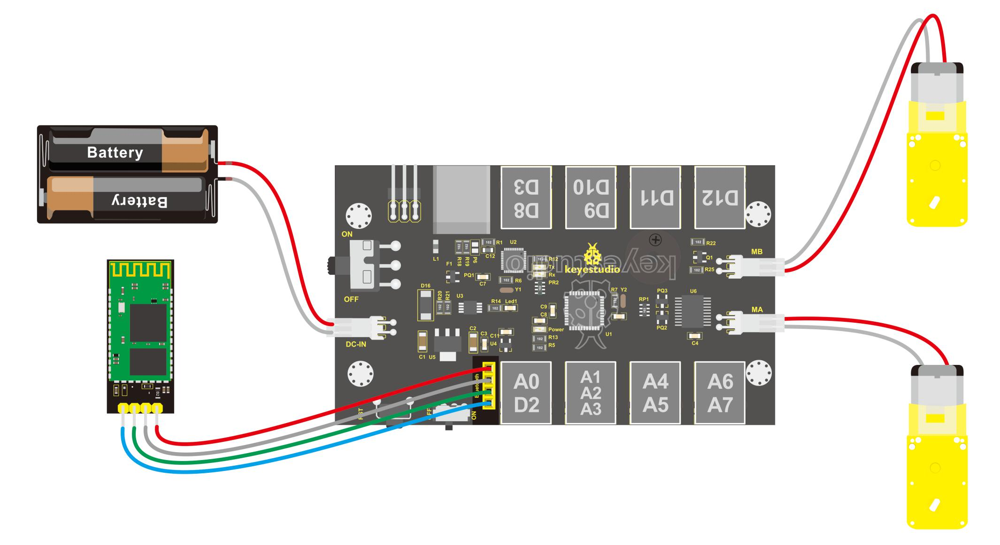

   KS0353 8

**Test Code 10**

::

       const int PWMA = 5;  // define the left motor speed pin D5
       const int PWMB = 6;  // define the right motor speed pin D6
       const int INT_A = 4;  // define the left motor control pin D4
       const int INT_B = 7;  // define the right motor control pin D7

       void setup() 
       {
       Serial.begin(9600);   // set the serial port baud rate to 9600
       
       pinMode(PWMA,OUTPUT);  // set the motor control pin as OUTPUT 
       pinMode(PWMB,OUTPUT);
       pinMode(INT_A,OUTPUT);
       pinMode(INT_B,OUTPUT);

       }

       void loop() 
       {
       int val;    // define the variable, used to save the Bluetooth signal value read.
       if(Serial.available())   // if the serial port has the available data
       {
           val = Serial.read();   // read the received data and assign it to val
       }
       switch(val)   //val data, corresponds to the data of the case statement below, then perform the corresponding data function. 
       {
           case 'U': front(); break;   // receive the val value U, and perform front(); then use break; to exit the current statement.
           case 'D': back(); break;
           case 'L': left(); break;
           case 'R': right(); break;
           case 'S': Stop(); break;
           default:Serial.print("error");    // if no corresponding data, print the error on serial monitor
       }
       }
       
       // forward
       void front()    
       {
       digitalWrite(INT_A,HIGH);  // left motor turns forward
       digitalWrite(INT_B,HIGH);   // right motor turns forward 
       analogWrite(PWMA,255);   // speed of left motor（PWM=255)
       analogWrite(PWMB,255);   // speed of right motor（PWM=255)
       }
       // backward
       void back()   
       {
       digitalWrite(INT_A,LOW);   // left motor turns reverse
       digitalWrite(INT_B,LOW);  // right motor turns reverse 
       analogWrite(PWMA,255);   // speed of left motor （PWM=255)
       analogWrite(PWMB,255);   // speed of right motor （PWM=255)
       }
       // turn left 
       void left()   
       {
       digitalWrite(INT_A,LOW);  // left motor turns reverse
       digitalWrite(INT_B,HIGH);  // right motor turns forward
       analogWrite(PWMA,200);   // speed of left motor（PWM=200)
       analogWrite(PWMB,200);   // speed of right motor（PWM=200)
       }
       // turn right 
       void right()   
       {
       digitalWrite(INT_A,HIGH);   // left motor turns forward
       digitalWrite(INT_B,LOW);   // right motor turns reverse
       analogWrite(PWMA,200);   // speed of left motor （PWM=200)
       analogWrite(PWMB,200);   // speed of right motor （PWM=200)
       }
       // stop
       void Stop()    
       {
       digitalWrite(INT_A,LOW);
       digitalWrite(INT_B,LOW);
       analogWrite(PWMA,0);  // speed of left motor（PWM=0)
       analogWrite(PWMB,0);  // speed of right motor（PWM=0)
       }

**Test Result**

Done uploading the above code to control board, open APP, connect the
Bluetooth, you should see the LED on the Bluetooth module is always on.
Press down any buttons on APP, you are able to control the KEYBOT run
freely.

|image15|

.. |image1| image:: media/03bcbac0c292a11cc4969884a260c24e.png
.. |image2| image:: media/c4beb46eae68ef824353b8cc72a19768.png
.. |image3| image:: media/95bb95aac8d2e5b92e8bfb5f6d3c3177.png
.. |image4| image:: media/81ed11f0705f918d1457cb772e41719f.png
.. |Arduino 1.8.5| image:: media/30fa40d2a88941da2ba013cfe38a6d30.png
.. |image5| image:: media/9734cce655eaba2646ef8b74e6bb7460.png
.. |image6| image:: media/00176d2bb73967f0295a5f61e88c04e1.png
.. |image7| image:: media/42b28476abc3d8b9b8845afb71a3a466.png
.. |arduino 1-8-5 port| image:: media/38e8a9778a86c754ca60fde89d66288e.png

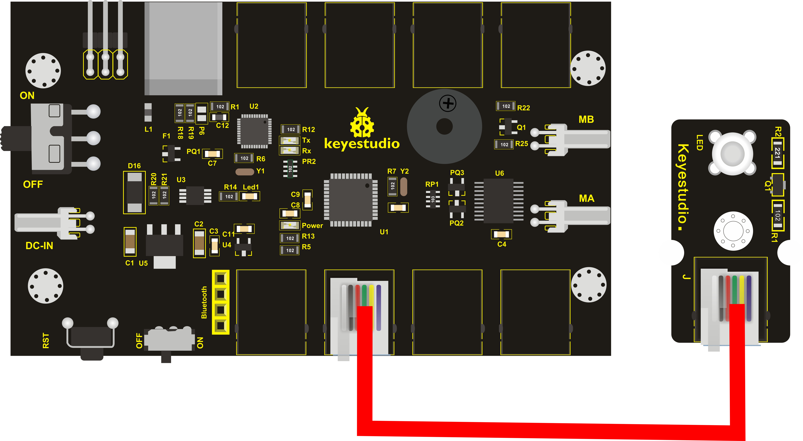
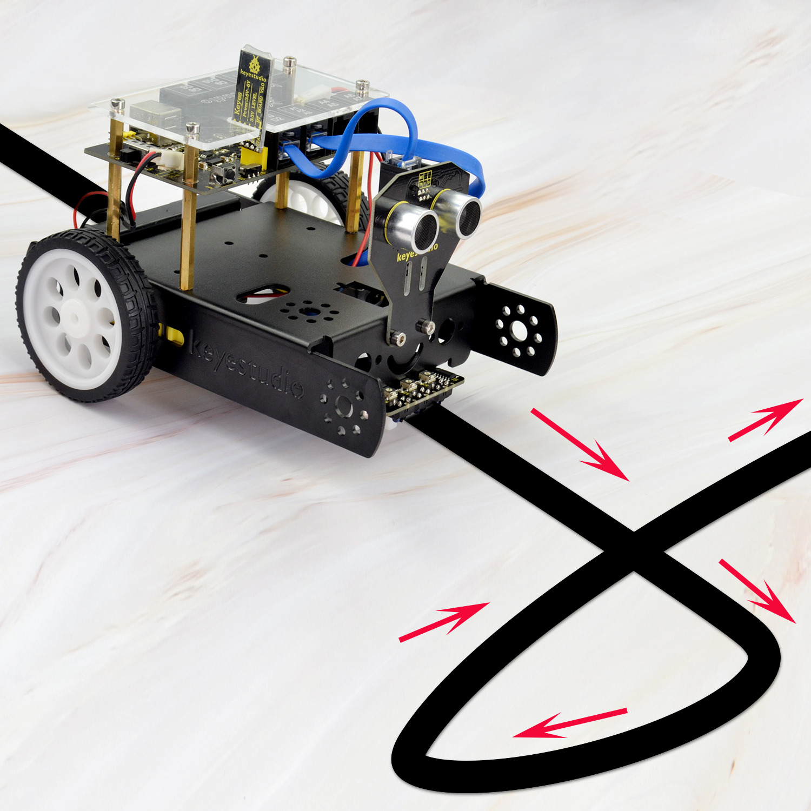
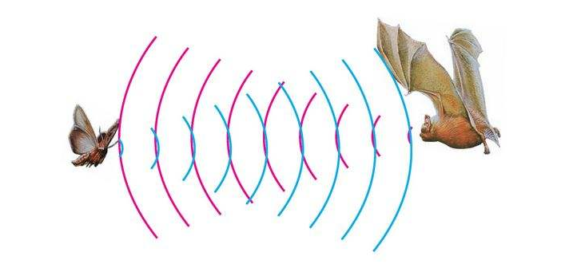
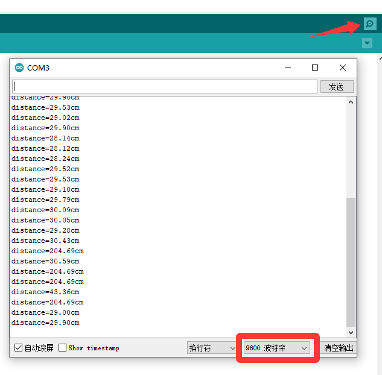
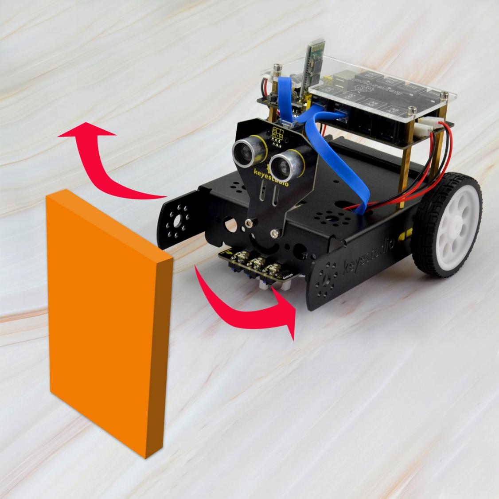
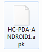
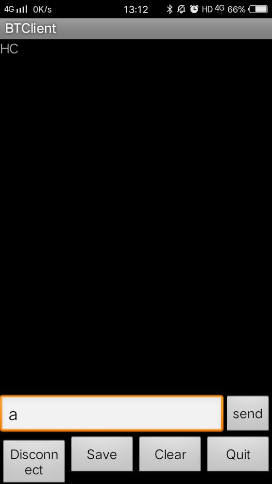
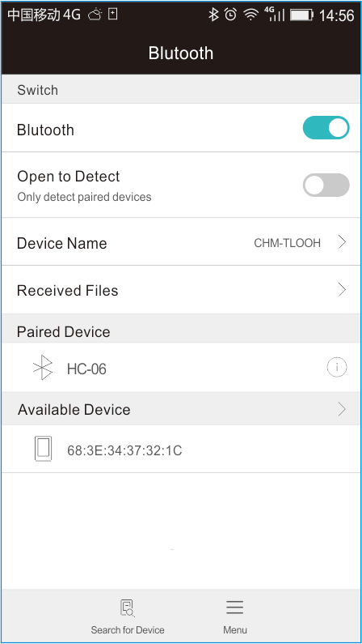
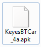
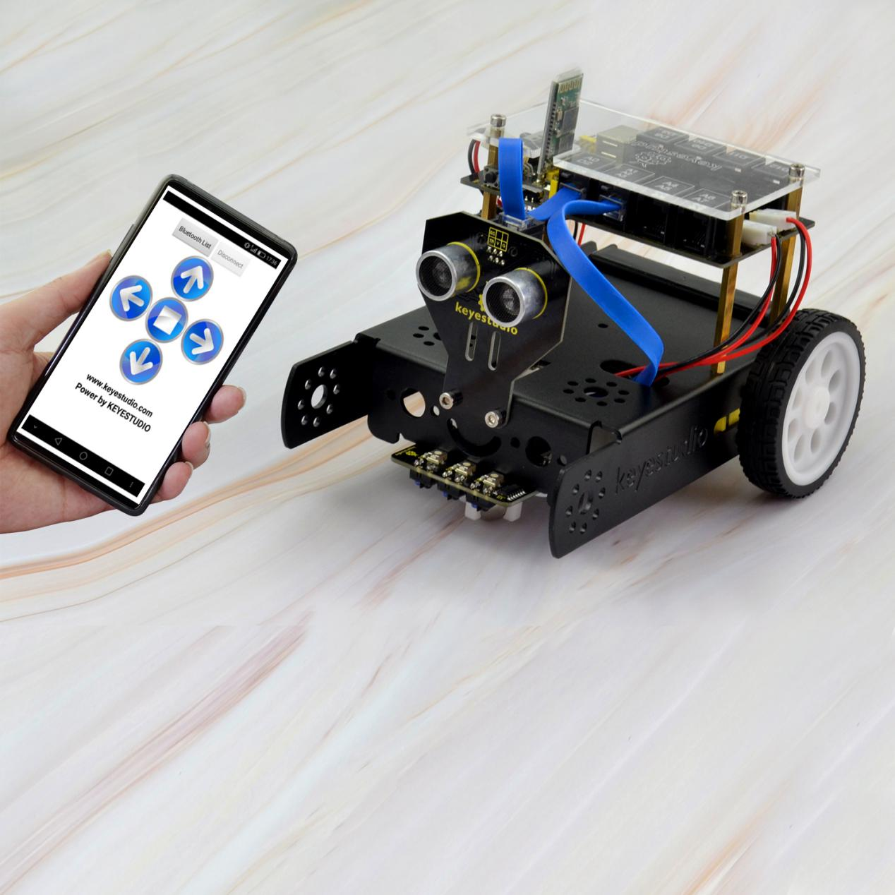
