Makecode Tutorial
=================

|image1|

Resource Download
-----------------

To help you quickly obtain related codes, libraries, and other support
files for this product, please click the links below to download:

-  :download:`Makecode Code and library downloads <./Code.7z>`

1.Getting Started with Micro:bit
--------------------------------

Step 1: connect the Micro: Bit main board V2 with your computer

Firstly, link the Micro: Bit main board V2 with your computer via the
USB cable.

|image2|

Step 2： if the red LED on the back of the board is on, that means the
board is powered. Then Micro: Bit main board V2 will appear on your
computer as a driver named ‘MICROBIT’. Please note that it is not an
ordinary USB disk as shown below.

|image3|

Step 3: write programs

https://makecode.microbit.org/

|image4|

Congratulations on completing your first code! You should now see the
5x5 LED dot matrix displaying various patterns.

Next, I will demonstrate downloading the written code to the computer
and uploading it using a different method.

|image5|

2. CoolTerm Installation
------------------------

CoolTerm program is used to read the data on serial port.

Download CoolTerm program:

macOS:

`Intel/ARM <https://freeware.the-meiers.org/CoolTermMac.dmg>`__

Win:

`Intel 64Bit <https://freeware.the-meiers.org/CoolTermWin64Bit.zip>`__

`Intel 32Bit <https://freeware.the-meiers.org/CoolTermWin32Bit.zip>`__

`ARM 64Bit <https://freeware.the-meiers.org/CoolTermWinARM64Bit.zip>`__

Linux:

`Intel 64Bit <https://freeware.the-meiers.org/CoolTermLinux64Bit.zip>`__

`Intel 32Bit <https://freeware.the-meiers.org/CoolTermLinux32Bit.zip>`__

(1) After the download, we need to install CoolTerm program file, below
    is Window system taken as an example.

(2) Choose “win” to download the zip file of CoolTerm

(3) Unzip file and open it. (also suitable for Mac and Linux system)

|image6|

The functions of each button on the Toolbar are listed below:

|image7|

========== ================================================
Command    Description
========== ================================================
New        Opens up a new Terminal
Open       Opens a saved Connection
Save       Saves the current Connection to disk
Connect    Opens the Serial Connection
Disconnect Closes the Serial Connection
Clear Data Clears the Received Data
Options    Opens the Connection Options Dialog
HEX        Displays the Terminal Data in Hexadecimal Format
View       Displays the Help Window
========== ================================================

After installation is complete, we will use this tool in our subsequent
lessons.

Project 1: Heartbeat
--------------------

|image8|

`Click to download the code for this lesson <./Code/Heartbeat.hex>`__

(1)Project Description
~~~~~~~~~~~~~~~~~~~~~~

(1) Project DescriptionThis project is easy to conduct with a micro:bit
    V2 main board, a Micro USB cable and a computer. The micro:bit LED
    dot matrix will display a relatively big heart-shaped pattern and
    then a smaller one. This alternative change of this pattern is like
    heart beating. This experiment serves as a starter for your entry to
    the programming world.

(2)Components Needed:
~~~~~~~~~~~~~~~~~~~~~

Micro:bit main board V2

Micro USB cable

(3)Test Code:
~~~~~~~~~~~~~

Attach the Micro:bit main board V2 to your computer via the Micro USB
cable and begin editing.

|image9|

Complete Program :

|image10|

Note: the “on start” means that the code in this block only executes
once, while “forever” implies that the code runs cyclically.

(4)Test Results:
~~~~~~~~~~~~~~~~

After uploading the code, you will see a heartbeat effect appear on the
Microbit board.

|image11|

Project 2: Light A Single LED
-----------------------------

|image12|

`Click to download the code for this
lesson <./Code/Light-A-Single-LED.hex>`__

.. _project-description-1:

(1)Project Description:
~~~~~~~~~~~~~~~~~~~~~~~

(1)Project Description:The LED dot matrix consists of 25 LEDs arranged
in a 5 by 5 square. In order to locate these LEDs quickly, as the figure
shown below, we can regarded this matrix as a coordinate system and
create two aces by marking those in rows from 0 to 4 from top to bottom,
and the ones in columns from 0 to 4 from the left to the right.
Therefore, the LED sat in the second of the first line is (1,0) and the
LED positioned in the fifth of the fourth column is (3,4) and others
likewise.

|image13|

.. _components-needed-1:

(2)Components Needed:
~~~~~~~~~~~~~~~~~~~~~

Micro:bit main board V2

Micro USB cable

.. _test-code-1:

(3)Test Code:
~~~~~~~~~~~~~

Attach the Micro:bit main board V2 to your computer via the Micro USB
cable and begin editing.

|image14|

Complete Program :

|image15|

.. _test-results-1:

(4)Test Results
~~~~~~~~~~~~~~~

After uploading the code, you will observe the Microbit board display
the following effect: (1,0) lights up for 0.5 seconds before turning
off, followed by (3,4) lighting up for 0.5 seconds before turning off,
repeating in a loop.

|image16|

Project 3: LED Dot Matrix
-------------------------

|image17|

`Click to download the code 1 for this
lesson <./Code/LED-Dot-Matrix.hex>`__

`Click to download the code 2 for this
lesson <./Code/LED-Dot-Matrix2.hex>`__

.. _project-description-2:

(1)Project Description:
~~~~~~~~~~~~~~~~~~~~~~~

Dot matrices are very commonplace in daily life. They have found wild
applications in LED advertisement screens, elevator floor display, bus
stop announcement and so on.

The LED dot matrix of Micro: Bit main board V2 contains 25 LEDs in a
grid. Previously, we have succeeded in controlling a certain LED to
light by integrating its position value into the test code. Supported by
the same theory, we can turn on many LEDs at the same time to showcase
patterns, digits and characters.

What’s more, we can also click” show icon ” to choose the pattern we
like to display. Last but not the least, we can design our patterns by
ourselves.

.. _components-needed-2:

(2)Components Needed:
~~~~~~~~~~~~~~~~~~~~~

Micro:bit main board V2

Micro USB cable

.. _test-code-1-1:

(3)Test Code 1:
~~~~~~~~~~~~~~~

Link computer with micro:bit board by micro USB cable, and program in
MakeCode editor.

|image18|

Complete Program :

|image19|

.. _test-results-1-1:

(4) Test Results 1:
~~~~~~~~~~~~~~~~~~~

Upload code 1 and power the board, we will see the icon.

.. figure:: ./media/8-1764036560155-18.gif
   :alt: 7

   7

(5) Test Code 2:
~~~~~~~~~~~~~~~~

Link computer with micro:bit board by micro USB cable, and program in
MakeCode editor.

|image20|

Complete Program :

|image21|

(6)Test Results 2 :
~~~~~~~~~~~~~~~~~~~

After uploading the code to the Microbit, you can see the 5x5 dot matrix
display cycling through the patterns and text specified in the
code.（Note: the “on start” means that the code in this block only
executes once, while “forever” implies that the code runs cyclically.）

|image22|

Project 4: Programmable Buttons
-------------------------------

|image23|

`Click to download the code 1 for this
lesson <./Code/Programmable-Buttons.hex>`__

`Click to download the code 2 for this
lesson <./Code/Programmable-Buttons2.hex>`__

.. _project-description-3:

(1)Project Description:
~~~~~~~~~~~~~~~~~~~~~~~

Buttons can be used to control circuits. In an integrated circuit with a
button, the circuit is connected when pressing the button and it is open
the other way around. Micro: Bit main board V2 boasts three buttons, two
are programmable buttons(marked with A and B), and the one on the other
side is a reset button. By pressing the two programmable buttons can
input three different signals. We can press button A or B alone or press
them together and the LED dot matrix shows A,B and AB respectively.
Let’s get started.

.. _components-needed-3:

(2)Components Needed:
~~~~~~~~~~~~~~~~~~~~~

Micro:bit main board V2

Micro USB cable

.. _test-code-1-2:

(3)Test Code 1 :
~~~~~~~~~~~~~~~~

Link computer with micro:bit board by micro USB cable, and program in
MakeCode editor,

|image24|

Complete Code:

|image25|

.. _test-results-1-2:

(4)Test Results 1 :
~~~~~~~~~~~~~~~~~~~

After uploading test code 1 to micro:bit main board V2 , the 5*5 LED dot
matrix shows A if button A is pressed, B if button B pressed, and AB if
button A and B pressed together.

|image26|

.. _test-code-2-1:

(5) Test Code 2 :
~~~~~~~~~~~~~~~~~

|image27|

Complete Program :

|image28|

.. _test-results-2-1:

(6)Test Results 2:
~~~~~~~~~~~~~~~~~~

After uploading test code 2 to micro:bit main board V2, when pressing
the button A the LEDs turning red increase while when pressing the
button B the LEDs turning red reduce.

|image29|

Project 5: Temperature Detection
--------------------------------

|image30|

`Click to download the code 1 for this
lesson <./Code/Temperature-Detection.hex>`__

`Click to download the code 2 for this
lesson <./Code/Temperature-Detection2.hex>`__

.. _project-description-4:

(1)Project Description:
~~~~~~~~~~~~~~~~~~~~~~~

The Micro:bit main board V2 is not equipped with a temperature sensor,
but uses the temperature sensor built into NFR52833 chip for temperature
detection. Therefore, the detected temperature is more closer to the
temperature of the chip, and there maybe deviation from the ambient
temperature.

.. _components-needed-4:

(2)Components Needed:
~~~~~~~~~~~~~~~~~~~~~

Micro:bit main board V2

Micro USB cable

.. _test-code-1-3:

(3)Test Code 1 :
~~~~~~~~~~~~~~~~

|image31|

.. _test-results-1-3:

(4)Test Results 1:
~~~~~~~~~~~~~~~~~~

After uploading test code 1 to micro:bit main board V2, powering the
main board via the USB cable, and clicking “Show console Device”, the
data of temperature shows in the serial monitor page as shown below.

|image32|

If you’re running Windows 7 or 8 instead of Windows 10, via

Google Chrome won’t be able to match devices. You’ll need to use the
CoolTerm serial monitor software to read data.You could open CoolTerm
software, click Options, select SerialPort, set COM port and put baud
rate to 115200 (after testing, the baud rate of USB SerialPort
communication on Micro: Bit main board V2 is 115200), click OK, and
Connect. The CoolTerm serial monitor shows the change of temperature in
the current environment, as shown in the figures below :

|image33|

.. _test-code-2-2:

(5)Test Code 2 :
~~~~~~~~~~~~~~~~

Link computer with micro:bit board by micro USB cable, and program in
MakeCode editor,

|image34|

Complete Program :

|image35|

.. _test-results-2-2:

(6)Test Results 2:
~~~~~~~~~~~~~~~~~~

After uploading the code 2, when the ambient temperature is less than
35℃, the 5*5 LED dot matrix shows |image36|. When the temperature is
equivalent to or greater than 35℃, the pattern |image37|\ appears.

Project 6: Geomagnetic Sensor
-----------------------------

`Click to download the code 1 for this
lesson <./Code/Geomagnetic-Sensor.hex>`__

`Click to download the code 2 for this
lesson <./Code/Geomagnetic-Sensor2.hex>`__

.. _project-description-5:

(1)Project Description:
~~~~~~~~~~~~~~~~~~~~~~~

(1) Project Description:This project aims to explain the use of the
    Micro: bit geomagnetic sensor, which can not only detect the
    strength of the geomagnetic field, but also be used as a compass to
    find bearings. It is also an important part of the Attitude and
    Heading Reference System (AHRS). Micro: Bit main board V2 uses
    LSM303AGR geomagnetic sensor, and the dynamic range of magnetic
    field is ± 50 gauss. In the board, the magnetometer module is used
    in both magnetic detection and compass. In this experiment, the
    compass will be introduced first, and then the original data of the
    magnetometer will be checked. The main component of a common compass
    is a magnetic needle, which can be rotated by the geomagnetic field
    and point toward the geomagnetic North Pole (which is near the
    geographic South Pole) to determine direction.

.. _components-needed-5:

(2)Components Needed:
~~~~~~~~~~~~~~~~~~~~~

Micro:bit main board V2

Micro USB cable

.. _test-code-1-4:

(3)Test Code 1 :
~~~~~~~~~~~~~~~~

Link computer with micro:bit board by micro USB cable, and program in
MakeCode editor.

|image38|

Complete Program :

|image39|

.. _test-results-1-4:

(4)Test Results 1 :
~~~~~~~~~~~~~~~~~~~

After uploading test code to micro:bit main board V2 and powering the
board via the USB cable, and pressing the button A, the board asks us to
calibrate compass and the LED dot matrix shows “TILT TO FILL SCREEN”.
Then enter the calibration page. Rotate the board until all 25 LEDs are
on red as shown below.

|image40|

calibrate compass:

|image41|

After that, a smile pattern |image42|\ appears, which implies the
calibration is done. When the calibration process is completed, pressing
the button A will make the magnetometer reading display directly on the
screen. And the direction north, east, south and west correspond to 0°,
90°, 180° and 270° respectively.

|image43|

.. _test-code-2-3:

(5) Test Code 2:
~~~~~~~~~~~~~~~~

This module can keep reading data to determine direction, so does point
to the current magnetic North Pole by arrow.

Link computer with micro:bit board by micro USB cable, and program in
MakeCode editor,

|image44|

Complete Program :

|image45|

.. _test-results-2-3:

(6) Test Results 2
~~~~~~~~~~~~~~~~~~

Upload code 2. After calibration, tilt micro:bit board, and the LED dot
matrix displays the direction signs.

|image46|

Project 7: Accelerometer
------------------------

|image47|

`Click to download the code 1 for this
lesson <./Code/Accelerometer.hex>`__

`Click to download the code 2 for this
lesson <./Code/Accelerometer2.hex>`__

.. _project-description-6:

(1)Project Description:
~~~~~~~~~~~~~~~~~~~~~~~

The Micro: Bit main board V2 has a built- in LSM303AGR gravity
acceleration sensor, also known as accelerometer, with a resolution of
8/10/12 bits. The code section sets the range to 1g, 2g, 4g, and 8g.

We often use accelerometer to detect the status of machines. In this
project, we will introduce how to measure the position of the board with
the accelerometer. And then have a look at the original three- axis data
output by the accelerometer.

.. _components-needed-6:

(2)Components Needed:
~~~~~~~~~~~~~~~~~~~~~

Micro:bit main board V2

Micro USB cable

.. _test-code-1-5:

(3)Test Code 1 :
~~~~~~~~~~~~~~~~

Link computer with micro:bit board by micro USB cable, and program in
MakeCode editor,

|image48|

Complete Program :

|image49|

.. _test-results-1-5:

(4)Test Results 1:
~~~~~~~~~~~~~~~~~~

After uploading Test Code 1 to the micro:bit V2 board, changing the
board’s orientation will cause the 5x5 dot matrix to display different
numbers.

|image50|

if we shake the Micro: Bit main board V2. no matter at any direction,
the LED dot matrix displays the digit “1”.

When it is kept upright ( make its logo above the LED dot matrix), the
number 2 shows.

|image51|

When it is kept upside down( make its logo below the LED dot matrix), it
shows as below.

|image52|

When it is placed still on the desk, showing its front side, the number
4 appears.

|image53|

When it is placed still on the desk, showing its back side, the number 5
exhibits.

When the board is tilted to the left, the LED dot matrix shows the
number 6 as shown below.

|image54|

When the board is tilted to the right, the LED dot matrix displays the
number 7 as shown below

|image55|

When the board is knocked to the floor, this process can be considered
as a free fall and the LED dot matrix shows the number 8. (please note
that this test is not recommended for it may damage the main board.)

Attention: if you’d like to try this function, you can also set the
acceleration to 3g, 6g or 8g. But still, we do not recommend.

.. _test-code-2-4:

(5)Test Code 2 :
~~~~~~~~~~~~~~~~

|image56|

Complete Program :

|image57|

.. _test-results-2-4:

(6) Test Results 2
~~~~~~~~~~~~~~~~~~

Upload test code to micro:bit main board V2, power the main board via
the USB cable, and click “Show console Device”.

The following interface shows the decomposition value of acceleration in
X axis, Y axis and Z axis respectively, as well as acceleration
synthesis (acceleration synthesis of gravity and other external forces).

|image58|

After referring to the MMA8653FC data manual and the hardware schematic
diagram of the Micro: Bit main board V2, the accelerometer coordinate of
the Micro: Bit V2 motherboard are shown in the figure below:

|image59|

If you’re running Windows 7 or 8 instead of Windows 10, via Google
Chrome won’t be able to match devices. You’ll need to use the CoolTerm
serial monitor software to read data.You could open CoolTerm software,
click Options, select SerialPort, set COM port and put baud rate to
115200 (after testing, the baud rate of USB SerialPort communication on
Micro: Bit main board V2 is 115200), click OK, and Connect. The CoolTerm
serial monitor shows the data of X axis, Y axis and Z axis, as shown in
the figures below:

|image60|

Project 8: Light Detection
--------------------------

|image61|

`Click to download the code for this
lesson <./Code/Light-Detection.hex>`__

.. _project-description-7:

(1) Project Description:
~~~~~~~~~~~~~~~~~~~~~~~~

In this project, we focus on the light detection function of the Micro:
Bit main board V2. It is achieved by the LED dot matrix since the main
board is not equipped with a photoresistor.

.. _components-needed-7:

(2)Components Needed:
~~~~~~~~~~~~~~~~~~~~~

Micro:bit main board V2

Micro USB cable

.. _test-code-3:

(3)Test Code:
~~~~~~~~~~~~~

Link computer with micro:bit board by micro USB cable, and program in
MakeCode editor,

|image62|

Complete Program :

|image63|

.. _test-results-3:

(4)Test Results:
~~~~~~~~~~~~~~~~

Upload the test code to micro:bit main board V2, power the board via the
USB cable and click “Show console Device”.

When the LED dot matrix is covered by hand, the light intensity showed
is approximately 0; when the LED dot matrix is exposed to light, the
light intensity displayed gets stronger with the light as shown below.

|image64|

If you’re running Windows 7 or 8 instead of Windows 10, via Google
Chrome won’t be able to match devices. You’ll need to use the CoolTerm
serial monitor software to read data.

You could open CoolTerm software, click Options, select SerialPort, set
COM port and put baud rate to 115200 (after testing, the baud rate of
USB SerialPort communication on Micro: Bit main board V2 is 115200),
click OK, and Connect. The CoolTerm serial monitor shows the value of
light intensity, as shown in the figures below :

|image65|

Project 9: Speaker
------------------

|image66|

`Click to download the code for this lesson <./Code/Speaker.hex>`__

.. _project-description-8:

(1)Project Description:
~~~~~~~~~~~~~~~~~~~~~~~

The Micro: Bit main board V2 has an built- in speaker, which makes
adding sound to the programs easier. We can program the speaker to air
all kinds of tones, like playing the son *Ode to Joy.*

.. _components-needed-8:

(2)Components Needed:
~~~~~~~~~~~~~~~~~~~~~

Micro:bit main board V2

Micro USB cable

.. _test-code-4:

(3)Test Code :
~~~~~~~~~~~~~~

Link computer with micro:bit board by micro USB cable, and program in
MakeCode editor,

|image67|

Complete Program :

|image68|

.. _test-results-4:

(4)Test Results:
~~~~~~~~~~~~~~~~

After uploading the test code to micro:bit main board V2 and powering
the board via the USB cable, the speaker utters sound and the LED dot
matrix shows the logo of music.

|image69|

Project 10: Touch-sensitive Logo
--------------------------------

|image70|

`Click to download the code for this
lesson <./Code/Touch-sensitive-Logo.hex>`__

.. _project-description-9:

(1)Project Description:
~~~~~~~~~~~~~~~~~~~~~~~

The Micro: Bit main board V2 is equipped with a golden touch- sensitive
logo, which can act as an input component and function like an extra
button.

It contains a capacitive touch sensor that senses small changes in the
electric field when pressed (or touched), just like your phone or tablet
screen do.When you press it , you can activate the program.

.. _components-needed-9:

(2)Components Needed:
~~~~~~~~~~~~~~~~~~~~~

Micro:bit main board V2

Micro USB cable

.. _test-code-5:

(3)Test Code :
~~~~~~~~~~~~~~

Link computer with micro:bit board by micro USB cable, and program in
MakeCode editor,

|image71|

Complete Program :

|image72|

.. _test-results-5:

(4)Test Results:
~~~~~~~~~~~~~~~~

After uploading the code, touching the logo with your hand will display
a heart shape on the dot matrix. Releasing your touch will reveal a
number, with longer contact times displaying larger numbers.

|image73|

Project 11: Microphone
----------------------

|image74|

`Click to download the code 1 for this lesson <./Code/Microphone.hex>`__

`Click to download the code 2 for this
lesson <./Code/Microphone2.hex>`__

.. _project-description-10:

(1)Project Description:
~~~~~~~~~~~~~~~~~~~~~~~

The Micro: Bit main board V2 is built with a microphone which can test
the volume of ambient environment. When you clap, the microphone LED
indicator turns on. Since it can measure the intensity of sound, you can
make a noise scale or disco lighting changing with music. The microphone
is placed on the opposite side of the microphone LED indicator and in
proximity with holes that lets sound pass. When the board detects sound,
the LED indicator lights up.

.. _components-needed-10:

(2) Components Needed:
~~~~~~~~~~~~~~~~~~~~~~

Micro:bit main board V2

Micro USB cable

.. _test-code-1-6:

(3) Test Code 1:
~~~~~~~~~~~~~~~~

Link computer with micro:bit board by micro USB cable, and program in
MakeCode editor,

|image75|

Complete Program :

|image76|

.. _test-results-1-6:

(4)Test Results 1:
~~~~~~~~~~~~~~~~~~

After uploading the code, display a large heart icon when ambient sound
is detected, and a small heart icon when the surroundings are quiet
(Note: Sounds too faint to detect will not trigger the response).

|image77|

.. _test-code-2-5:

(5)Test Code 2:
~~~~~~~~~~~~~~~

Link computer with micro:bit board by micro USB cable, and program in
MakeCode editor,

|image78|

Complete Program :

|image79|

.. _test-results-2-5:

(6)Test Results 2:
~~~~~~~~~~~~~~~~~~

|image80|

After uploading the code, the dot matrix pulses in sync with sound
changes. Pressing the “A” key displays the numerical value of the
current sound.

Project 12: Bluetooth Wireless Communication
--------------------------------------------

|image81|

.. _project-description-11:

(1)Project Description:
~~~~~~~~~~~~~~~~~~~~~~~

Note: This lesson focuses on explaining how to upload code via Bluetooth
using an app, so no code is provided. Please follow the steps in the
animated gif.

The Micro: Bit main board V2 comes with a nRF52833 processor (with a
built- in BLE(Bluetooth Low Energy) device Bluetooth 5.1 ) and a 2.4GHz
antenna for Bluetooth wireless communication and 2.4GHz wireless
communication. With the help of them, the board is able to communicate
with a variety of Bluetooth devices, including smart phones and tablets.

In this project, we mainly concentrate on the Bluetooth wireless
communication function of this main board. Linked with Bluetooth, it can
transmit code or signals. To this end, we should connect an Apple device
(a phone or an iPad) to the board.

Since setting up Android phones to achieve wireless

transmission is similar to that of Apple devices, no need to illustrate
again.

(2) Preparation
~~~~~~~~~~~~~~~

Attachment of Micro:bit main board V2 to your computer via the Micro USB
cable.

An Apple device (a phone or an iPad) or an Android device;

(3) Install Micro:bit:
~~~~~~~~~~~~~~~~~~~~~~

For Android

|image82|

For ios

|image83|

(4)Test Code :

Next, we’ll use our phones to write code and connect via Bluetooth
(Note: The process is identical for both Android and iOS devices; this
demonstration uses an Android phone).

1、Open the software and connect to Bluetooth.

|image84|

2、Press Microbit’s button A, button B, and the reset button on the back
in sequence. The main board will then display an icon.

|image85|

3、Enter the pattern displayed in step two into the phone interface.

|image86|

Write code and upload

1、Enter the code programming interface and write a code.

|image87|

2、Press button A, button B, and the reset button in sequence. (Note:
This procedure must be repeated each time code is uploaded via the app.)

|image88|

3、After confirming that the Microbit icon matches the one displayed on
your phone, simply click “Next.”

|image89|

Finally, you can see the Microbit board displaying the pattern from the
code.

Here, we have completed the process of uploading code to the phone. It
is important to note:

1. To connect the phone to the Microbit board, press the A, B, and Reset
   buttons in sequence. The dot matrix display will then show a pattern,
   which should be entered into the phone.
2. The Microbit board can be powered via a USB cable or by supplying 3V
   to the board’s power input through a battery pack. Note: The voltage
   must not exceed 3V, as exceeding this limit will damage the board.

Project 13：Seven-Color LED
---------------------------

|image90|

1. **Description**

This module consists of a commonly used LED with 7colors but in white
appearance. It can automatically flash different colors to create
fantastic light effects when high level is input like a normal LED.

2. **Preparation**

- Insert the micro:bit board into the slot of keyestudio
  4WD Mecanum Robot Car V2.0

- Place batteries into battery holder

- Dial power switch to ON end

- Connect the micro:bit to your computer via an USB cable

- Open the Web version of Makecode.

3. **Test Code1**

Make the RGB light flash 7 lights alternatively.

|image91|

Click“JavaScript”to view the corresponding JavaScript code:

|image92|

4. **Test Result1**

Download code 1 to micro:bit board and dial POWER switch to ON end, 2
RGB lights of smart car emit red, green, blue, indigo, dark red, yellow
and white color cyclically.

5. **Test Code2**

|image93|

Click“JavaScript”to view the corresponding JavaScript code:

|image94|

6. **Test Result2**

Download code 2 to micro:bit board, 2 RGB lights will flash for 1 second
and then stop flashing for 1 second, cyclically.

Project 14：4 WS2812 RGB LEDs
-----------------------------

|image95|

1. **Description**

The driver shield cooperates 4 pcs WS2812 RGB LEDs, compatible with
micro:bit board and controlled by P7. In this lesson, we will make the
RGB LEDs display different colors by P7. In this lesson, 3 sets of test
code are provided to make the 4 WS2812 RGB LEDs display different
effects.

2. **Preparation**

- Insert the micro:bit board into the slot of keyestudio
  4WD Mecanum Robot Car V2.0

- Place batteries into battery holder

- Dial power switch to ON end

- Connect the micro:bit to your computer via an USB cable

- Open the Web version of Makecode.

3. **Test Code1**

|image96|

Click“JavaScript” to switch into the corresponding JavaScript code:

|image97|

4. **Test Result1**

Download code 1 to micro：bit, and dial POWER to ON end. All four
WS2812RGB LEDs light up a different color a time cyclically.

5. **Test Code2**

|image98|

|image99|

|image100|

Click“JavaScript” to switch into the corresponding JavaScript code:

|image101|

|image102|

6. **Test Result2**

Download code 2 to micro：bit, WS2812RGB LEDs display like flow light.

7. **Test Code3**

|image103|

Click“JavaScript”to switch into the corresponding JavaScript code:

|image104|

8. **Test Result3**

Download code 3 to micro：bit, every WS2812RGB light shows random color
one by one.

Project 15：Servo
-----------------

|image105|

1. **Description**

For those DIY smart cars, they often have the function of automatic
obstacle avoidance. In the DIY process, we need to use a servo to
control the ultrasonic module to rotate left and right, and then detect
the distance between the car and the obstacle, so as to control the car
to avoid the obstacle. If other microcontrollers are used to control the
rotation of the servo, we need to set a certain frequency and a certain
width of pulse to control the servo angle.

However, if the micro:bit main board is used to control the servo angle,
we only need to set the control angle in the development environment
where the corresponding pulse will be automatically set to control the
servo rotation. In this project, you will learn how to control the servo
to rotate back and forth between 0° and 90°.

2. **Information of the Servo**

Servo motor is a position control rotary actuator. It mainly consists of
housing, circuit board, core-less motor, gear and position sensor. Its
working principle is that the servo receives the signal sent by MCU or
receiver, and produces a reference signal with a period of 20ms and
width of 1.5ms, then compares the acquired DC bias voltage to the
voltage of the potentiometer and obtains the voltage difference output.

|image106|

For the servo used in this project, the brown wire is the ground, the
red one is the positive wire, and the orange one is the signal wire.

The rotation angle of servo motor is controlled by regulating the duty
cycle of PWM (Pulse-Width Modulation) signal. The standard cycle of PWM
signal is 20ms (50Hz). Theoretically, the width is distributed
between 1ms-2ms, but in fact, it’s between 0.5ms-2.5ms. The width
corresponds to the rotation angle from 0° to 180°. But note that for
different brand motor, the same signal may have different rotation
angle. 

|image107|

More details:

|image108|

3. **Parameters**

- Working voltage: DC 4.8V ~ 6V

- Operating angle range: about 180 ° (at 500 → 2500 μsec)

- Pulse width range: 500 → 2500 μsec

- No-load speed: 0.12 ± 0.01 sec / 60 (DC 4.8V) 0.1 ± 0.01 sec / 60 (DC
  6V)

- No-load current: 200 ± 20mA (DC 4.8V) 220 ± 20mA (DC 6V)

- Stopping torque: 1.3 ± 0.01kg · cm (DC 4.8V) 1.5 ± 0.1kg · cm (DC 6V)

- Stop current: ≦ 850mA (DC 4.8V) ≦ 1000mA (DC 6V)

- Standby current: 3 ± 1mA (DC 4.8V) 4 ± 1mA (DC 6V)

4. **Preparation**

- Insert the micro:bit board into the slot of keyestudio
  4WD Mecanum Robot Car V2.0

- Place batteries into battery holder

- Dial power switch to ON end

- Connect the micro:bit to your computer via an USB cable

- Open the Web version of Makecode

5. **Test Code**

|image109|

Click“JavaScript” to view the corresponding JavaScript code:

|image110|

6. **Test Result**

After uploading the test code and dial POWER switch to ON end, the servo
rotates from 0 degree to 180 degrees.

Project 16：Motor
-----------------

|image111|

1. **Description**

The Keyestudio 4WD Mecanum Robot Car is equipped with 4 DC reduction
motors, also called gear reduction motor, which is developed on the
ordinary DC motor. It has a matching gear reduction box which provides a
lower speed but a larger torque. Furthermore, different reduction ratios
of the box can provide different speeds and torques.

Gear motor is the integration of gearmotor and motor, which is applied
widely in steel and machine industry

Micro:bit motor driver shield comes with a DRV8833 chip. In order to
save the IO port resource, we control the rotation direction and speed
of 4 DC gear motors with the DRV8833 chip.

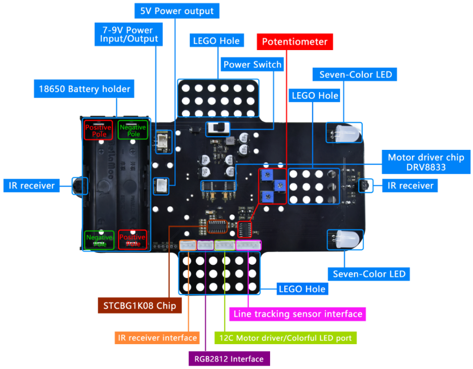

   Img

Front

|image112|

Back

|image113|

STC8G1K08 Chip circuit

|image114|

HR8833 Motor driver circuit

2. **Preparation**

- Insert the micro:bit board into the slot of keyestudio
  4WD Mecanum Robot Car V2.0

- Place batteries into battery holder

- Dial power switch to ON end

- Connect the micro:bit to your computer via an USB cable

- Open the Web version of Makecode

3. **Test Code1**

|image115|

Click“JavaScript” to view the corresponding JavaScript code:

|image116|

4. **Test Result1**

Download code 1 to micro:bit board, dial POWER switch to ON end. Smart
car goes forward for 2s and stops for 2s.

5. **Test Code2**

|image117|

.. figure:: ./media/code27-1.png
   :alt: Img

   Img

Click“JavaScript” to view the corresponding JavaScript code:

|image118|

6. **Test Result2**

Download code 2 to micro:bit board, the car goes forward for 2s, turns
back for 2s, turn left for 2s, turn right for 2s and stops for 2s and
repeats this pattern.

Project 17：Line Tracking Sensor
--------------------------------

Project 17.1：Detect Line Tracking Sensor
~~~~~~~~~~~~~~~~~~~~~~~~~~~~~~~~~~~~~~~~~

|image119|

1. **Description**

The motor driver board of the Keyestudio 4WD Mecanum Robot Car comes
with a 3-channel line tracking sensor, which adopts TCRT5000 IR tubes
and 3 potentiometers.

The TCRT5000 IR tube contains an IR emitting tube and an IR receiving
tube. When the infrared signals of the emitting tube is received by the
receiving tube through reflection, the resistance of the receiving tube
will change, which is generally reflected in the voltage change on the
circuit.  

The resistance varies depending on the intensity of the infrared signals
received by the receiving tube, which is often in the color of the
reflecting surface and the distance of the reflecting surface receiving
tube.  At the time of detection, black is high level active and white is
low level active. 

2. **Working Principle**

When the car runs above a white road, the IR emitting tube installed
under the car emits infrared signals to detect the road and the
receiving tube will receive signals sending back. Then the output end
outputs low level(0); when it detects black lines, it outputs high
level(1).

After putting a white paper on the bottom of the 4WD Mecanum Robot Car,
we will rotate the potentiometers on the 3-way tracking sensor. When the
indicator light on the sensor module is on, pick up the car to make the
two wheels on the 4WD Mecanum Robot Car separate. The height of the
white paper is about 1.5cm, when the indicator light on the sensor
module is off, and then the sensitivity is adjusted.

3. **Preparation**

- Insert the micro:bit board into the slot of keyestudio
  4WD Mecanum Robot Car V2.0

- Place batteries into battery holder

- Dial power switch to ON end

- Connect the micro:bit to your computer via an USB cable

- Open the Web version of Makecode

4. **Test Code**

|image120|

Click“JavaScript” to view the corresponding JavaScript code:

|image121|

5. **Test Result**

Download code to micro:bit board, dial POWER switch to ON end.

Open CoolTerm, click Options to select SerialPort. Set COM port and
115200 baud rate. Click“OK”and“Connect”.

|image122|

|image123|

|image124|

|image125|

The CoolTerm serial monitor displays the digital signals read by the
line tracking sensors.

|image126|

Project 17.2：Tracking Smart Car
~~~~~~~~~~~~~~~~~~~~~~~~~~~~~~~~

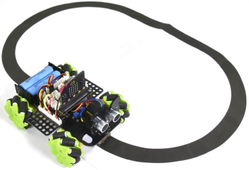

   Img

1. **Description**

In this lesson we will combine a line tracking sensor with a motor to
make a line tracking smart car.

The micro:bit board will analyze the signals and control the smart car
to show the line tracking function.

2. **Working Principle**

The smart car will make different moves according to the value received
by the 3-channel line tracking sensor.

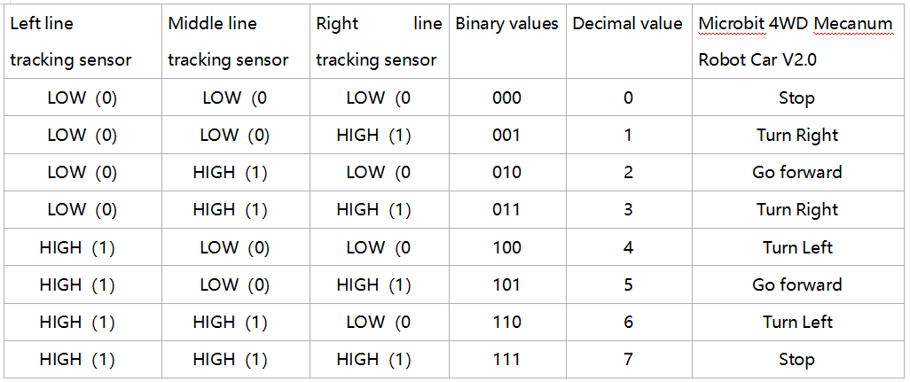

   Img

3. **Preparation**

- Insert the micro:bit board into the slot of keyestudio
  4WD Mecanum Robot Car V2.0

- Place batteries into battery holder

- Dial power switch to ON end

- Connect the micro:bit to your computer via an USB cable

- Open the Web version of Makecode

**Warning:** The 3-way tracking sensor should be used in environments
without infrared interference such as sunlight. Sunlight contains a lot
of invisible light, such as infrared and ultraviolet. In an environment
with strong sunlight, the 3-way tracking sensor cannot work properly.

4.\ **Flow Chart**

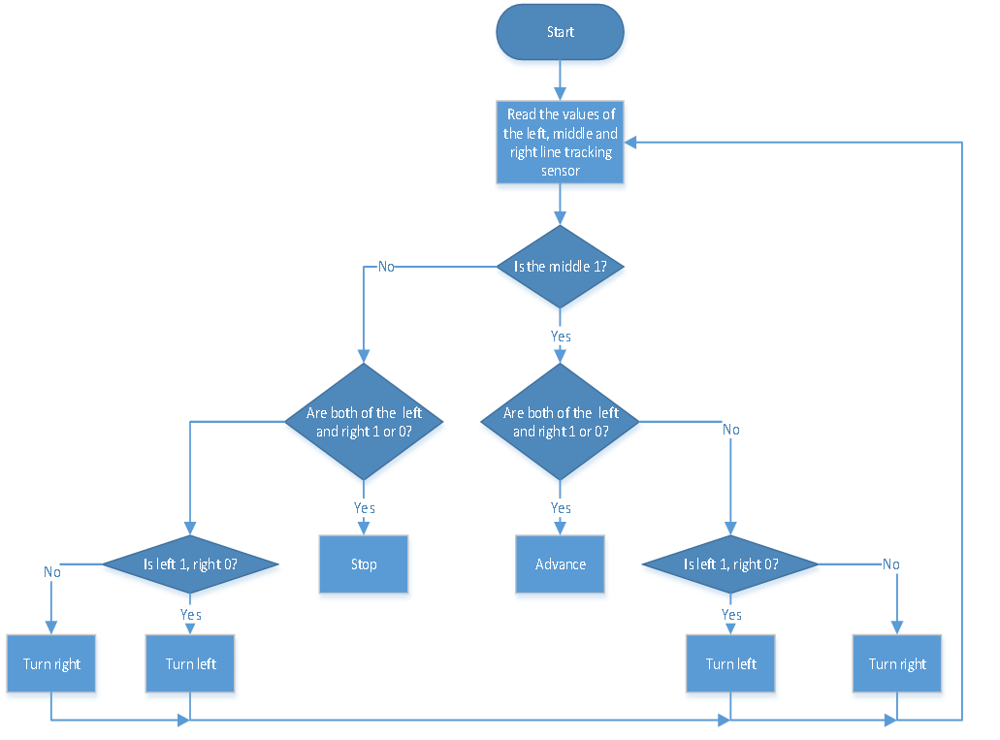

   Img

5. **Test Code**

|image127|

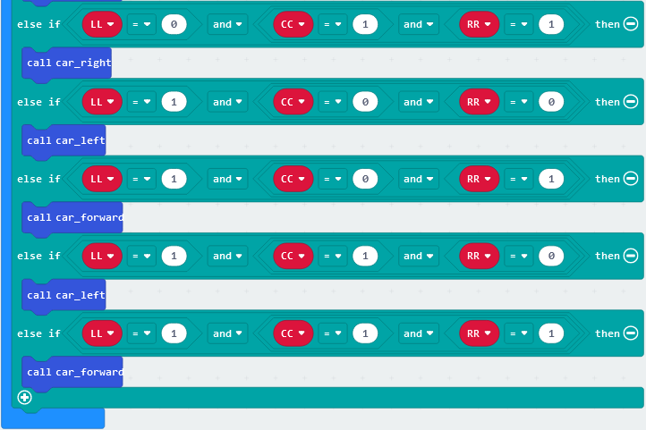

   Img

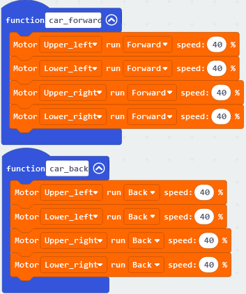

   Img

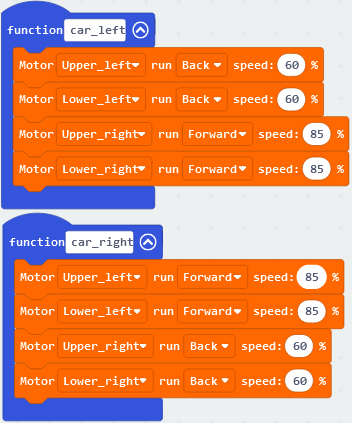

   Img

Click“JavaScript”to view the corresponding JavaScript code:

|image128|

|image129|

5. **Test Result**

Download code to micro:bit and dial POWER to ON end, line tacking car
goes forward along black line .

**Note:** turn on the switch at the back of micro:bit car, the width of
black line should be larger than the width of line tracking sensor.

Avoid to test smart car under the strong light.

Project 18：Ultrasonic Sensor
-----------------------------

Project 18.1：Ultrasonic Ranging
~~~~~~~~~~~~~~~~~~~~~~~~~~~~~~~~

1. **Description**

The ultrasonic sensor uses sonar to determine distance to an object like
bats do. It offers excellent non-contact range detection with high
accuracy and stable readings in an easy-to-use package. It comes
complete with ultrasonic transmitter and receiver modules.

The ultrasonic sensor is being used in a wide range of electronics
projects for creating obstacle detection and distance measuring
application as well as various other applications.

|image130|

The ultrasonic module will emit the ultrasonic waves after trigger
signals. When the ultrasonic waves encounter the object and are
reflected back, the module outputs an echo signal, so it can determine
the distance of object from the time difference between trigger signal
(TRIG)and echo signal(ECHO).

As the picture shows, it is like two eyes. One is transmitting end, the
other is receiving end.

According to the above wiring diagram, the integrated port of the
ultrasonic sensor module is connected to the 5V G P15 P16 port on the
micro:bit motor driver base plate. The Trig (T) pin is controlled by P15
of the micro:bit and the pin of Echo (E) the P16.

|image131|

2. **Working Principle**

|image132|

(1)Pull down TRIG then trigger high level signals with least 10us;

(2)After triggering, the module will automatically send eight 40KHz
ultrasonic pulses and detect whether there is a signal return;

(3)If there is a signal return, when ECHO (E) outputs a high level, then
the duration of the high level is the time from transmission to
reception of the ultrasonic waves. Then test distance = high level
duration \*340m/s*0.5. 

3. **Parameters**

- Working voltage: 3-5.5V (DC)

- Working current: 15mA

- Working frequency: 40khz

- Maximum detection distance: about 3m

- Minimum detection distance: 2-3cm

- Precision: up to 0.2cm

- Sensing angle: less than 15 degrees

- Input trigger pulse: 10us TTL level

- Output echo signal: output TTL level signal (high), proportional to
  range

4. **Preparation**

- Insert the micro:bit board into the slot of keyestudio
  4WD Mecanum Robot Car V2.0

- Place batteries into battery holder

- Dial power switch to ON end

- Connect the micro:bit to your computer via an USB cable

- Open the Web version of Makecode

5. **Test Code**

|image133|

Click“JavaScriptto view the corresponding JavaScript code:

|image134|

6. **Test Result**

Download code to micro:bit, keep USB cable connected, dial POWER switch
to ON end. The distance value will be displayed on monitor.

|image135|

The monitor shows the distance between the obstacle and ultrasonic
sensor(as shown below).

|image136|

Open CoolTerm, click Options to select SerialPort. Set COM port and
115200 baud rate(the baud rate of USB serial communication of Micro:bit
is 115200 through the test). Click “OK” and “Connect”.

CoolTerm serial monitor displays the distance value as follows:

|image137|

Project 18.2：Ultrasonic Avoidance
~~~~~~~~~~~~~~~~~~~~~~~~~~~~~~~~~~

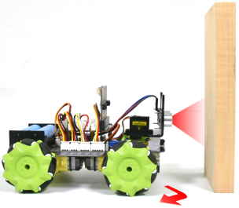

   Img

1. **Description**

In this project, we will integrate an ultrasonic sensor and a car to
make an ultrasonic avoidance car.

Its principle is to detect the distance between the car and obstacle via
the ultrasonic sensor to control the motion of smart car.

2. **Preparation**

- Insert the micro:bit board into the slot of keyestudio
  4WD Mecanum Robot Car V2.0

- Place batteries into battery holder

- Dial power switch to ON end

- Connect the micro:bit to your computer via an USB cable

- Open the Web version of Makecode

3. **Flow Chart**

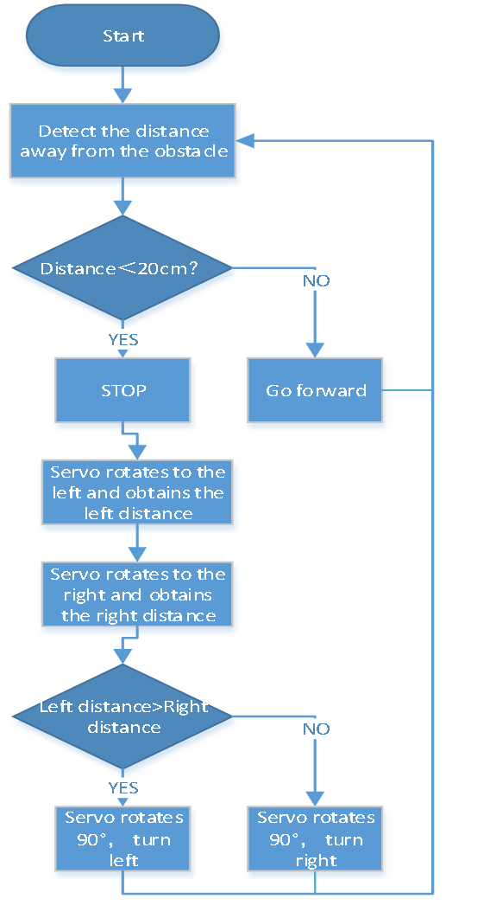

   Img

4. **Test Code**

|image138|

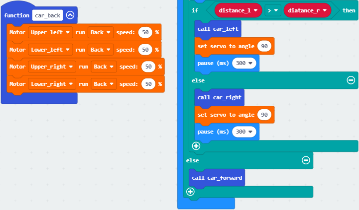

   Img

Click“JavaScript”to view the corresponding JavaScript code:

|image139|

|image140|

5. **Test Result**

Download code to micro:bit, dial to ON end, and dial POWER to ON end.
When the obstacle distance is greater than 20cm, the car goes forward ;
on the contrary, smart car turns left.

Project 18.3：Ultrasonic Following
~~~~~~~~~~~~~~~~~~~~~~~~~~~~~~~~~~

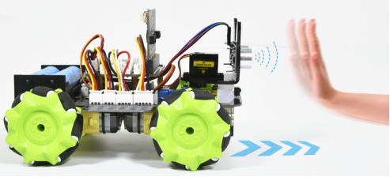

   Img

1. **Description**

In previous lesson, we’ve learned the basic principle of line tracking
sensor. Next, we will combine the ultrasonic sensor with the car to make
an ultrasonic following car.

The ultrasonic sensor detects the obstacle distance and control the
motion status of car.

2. **Preparation**

- Insert the micro:bit board into the slot of keyestudio
  4WD Mecanum Robot Car V2.0

- Place batteries into battery holder

- Dial power switch to ON end

- Connect the micro:bit to your computer via an USB cable

- Open the Web version of Makecode

3. **Flow Chart**

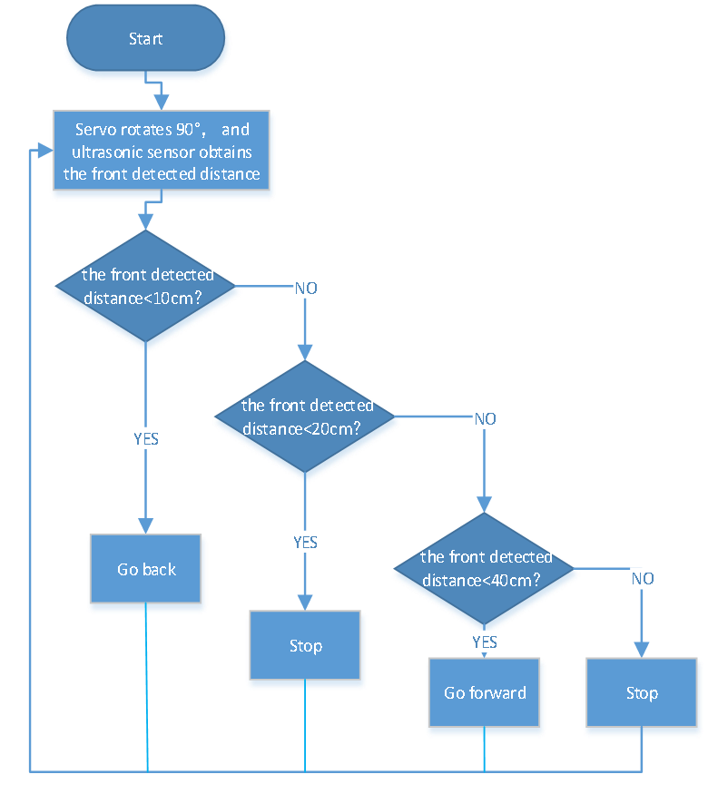

   Img

4. **Test Code**

|image141|

Click“JavaScript”to view the corresponding JavaScript code:

|image142|

5. **Test Result**

Download code to micro:bit, dial POWER switch to ON end on shield, smart
car could follow the obstacle to move.

Project 19：IR Remote Control
-----------------------------

Project 19.1：Decode IR Remote Control
~~~~~~~~~~~~~~~~~~~~~~~~~~~~~~~~~~~~~~

|image143|

1. **Description**

There is no doubt that infrared remote control is ubiquitous in daily
life. It is used to control various household appliances, such as TVs,
stereos, video recorders and satellite signal receivers. Infrared remote
control is composed of infrared transmitting and infrared receiving
systems, that is, an infrared remote control, an infrared receiving
module and a single-chip microcomputer capable of decoding.

|image144|

The 38K infrared carrier signal emitted by remote controller is encoded
by the encoding chip in the remote controller. It is composed of a
section of pilot code, user code, user inverse code, data code, and data
inverse code. The time interval of the pulse is used to distinguish
whether it is a 0 or 1 signal and the encoding is made up of these 0, 1
signals.

The user code of the same remote control is unchanged. The data code can
distinguish the key.

When the remote control button is pressed, the remote control sends out
an infrared carrier signal. When the IR receiver receives the signal,
the program will decode the carrier signal and determines which key is
pressed. The MCU decodes the received 01 signal, thereby judging what
key is pressed by the remote control.

Infrared receiver we use is an infrared receiver module. Mainly composed
of an infrared receiver head, it is a device that integrates reception,
amplification, and demodulation. Its internal IC has completed
demodulation, and can achieve from infrared reception to output and be
compatible with TTL signals. Additionally, it is suitable for infrared
remote control and infrared data transmission. The infrared receiving
module made by the receiver has only three pins, signal line, VCC and
GND.

According to the picture above, the integrated port of the infrared
receiver is connected to the P9 5V G port on the motor driver board and
controlled by the the P9 of the micro:bit.

2. **Parameters:**

- Operating Voltage: 3.3-5V（DC）

- Interface: 3PIN

- Output Signal: Digital signal

- Receiving Angle: 90 degrees

- Frequency: 38khz

- Receiving Distance: about 5m

3. **Preparation**

- Insert the micro:bit board into the slot of keyestudio
  4WD Mecanum Robot Car V2.0

- Place batteries into battery holder

- Dial power switch to ON end

- Connect the micro:bit to your computer via an USB cable

- Open the Web version of Makecode

4. **Test Code**

|image145|

Click“JavaScript” to switch into the corresponding JavaScript code:

|image146|

**Code explanation:** If the buttons are not pressed, the serial monitor
constantly shows 0; when pressed, the corresponding key values are
displayed.

**Notes：**

The remote control in this kit is not inclusive of batteries. We
recommend you to purchase them online.(battery type:CR2025).

Make sure IR remote is good before test. There is a tip for you to check
it.

Open the cellphone camera , make IR remote control point at camera and
press button. The remote control is good if you see the purple flashing
light in the camera.

5. **Test Result**

Download code to micro: bit board and don’t plug off USB cable
Click\ |image147|

|image148|

Make IR remote control point at IR receiver and press the button, the
serial monitor will display the corresponding key values, as shown
below：

|image149|

Open CoolTerm, click Options to select SerialPort. Set COM port and
115200 baud rate. Click“OK”and“Connect”.

CoolTerm serial monitor shows the key value as follows:

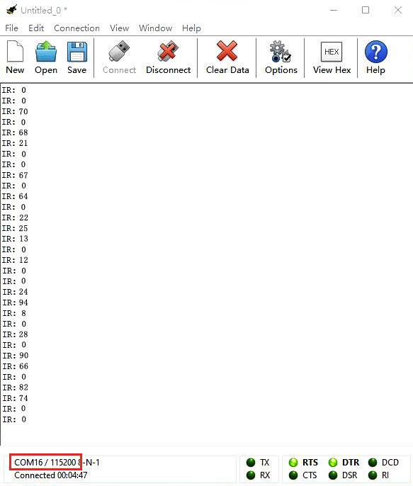

   Img

The key value is displayed as for your reference:

|image150|

Project 19.2：IR Remote Control
~~~~~~~~~~~~~~~~~~~~~~~~~~~~~~~

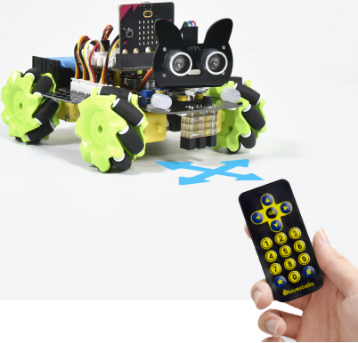

   Img

1. **Description**

In this project, we combine IR remote control with car shield to make an
IR remote smart car. Its principle is to control the motion of car by
sending key signals from IR remote control to IR receiving module of car
shield.

2. **Preparation**

- Insert the micro:bit board into the slot of keyestudio
  4WD Mecanum Robot Car V2.0

- Place batteries into battery holder

- Dial power switch to ON end

- Connect the micro:bit to your computer via an USB cable

- Open the Web version of Makecode

**Note:** The infrared sensor and infrared remote control should not be
used in environments with infrared interference such as sunlight for it
contains a lot of invisible lights, such as infrared and ultraviolet. In
an environment with strong sunlight, they cannot work normally.

3. **Flow Chart**

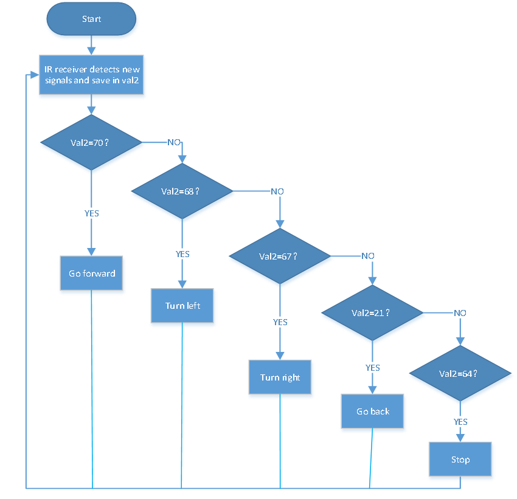

   Img

4. **Test Code**

|image151|

Click“JavaScript” to switch into the corresponding JavaScript code:

|image152|

|image153|

5. **Test Result**

Download code to micro:bit board, and dial POWER to ON end.

Make IR remote control point at micro:bit and press the button to
control smart car to move.

|image154|\ button makes smart car move forward，\ |image155|\ stands
for turning left，\ |image156|\ implies rightward turning,
|image157|\ indicates moving backward，\ |image158| stops car.

**Note:** The distance between IR remote control and IR receiving head
of smart car are supposed less than 5m during the test.

Project 20：Bluetooth Multi-purpose Smart Car
---------------------------------------------

Project 20.1：Read Bluetooth Data
~~~~~~~~~~~~~~~~~~~~~~~~~~~~~~~~~

|image159|

1. **Description**

Micro:bit main board comes with a built-in Bluetooth which can be used
to communicate with it. And the Micro:bit can also be controlled by
Bluetooth or transmit signals back to smartphone or computer via it.
This Bluetooth can communicate with the Bluetooth equipped in other
devices or with Bluetooth App to control other equipment.

It is compatible with both Android system ans IOS system. And we have
designed two Bluetooth Apps for both systems.

The connection of the Bluetooth on the board with these two Apps is
similar. In this lesson, we will introduce the functions of all keys and
patterns on the Apps and control the smart car via Bluetooth App.

2. **Preparation**

- Insert the micro:bit board into the slot of keyestudio
  4WD Mecanum Robot Car V2.0

- Place batteries into battery holder

- Dial power switch to ON end

- Connect the micro:bit to your computer via an USB cable

- Open the Web version of Makecode

**If you choose to drag the code manually, you need to add the Bluetooth
extension library first. Click the gear icon (Settings) in the upper
right corner, then click on Extensions to go to the library file
selection screen, and then click on the “Bluetooth” extension library
(if it doesn’t exist, search Bluetooth to find it), as shown below:** 

|image160|

As the Bluetooth and extension radio can’t work together, therefore,
their extension libraries are not compatible.

Therefore, remove extension(s) and add Bluetooth please if you see the
following prompt box pop up.

|image161|

3. **Test Code**

|image162|

Click“JavaScript”to view the corresponding JavaScript code:

|image163|

4. **Test Result**

If you drag blocks step by step, you need to set as follows after
finishing test code.

|image164|

|image165|

|image166|

However, you could skip this step if you directly import test code.

After setting, download code to micro:bit board, don’t plug off the USB
cable.Next to download App.

**For IOS System:**

a. Open App Store;

|image167|

b. Search **mecanum_robot** and click“\ |image168|\ ”to download the
Bluetooth App of mecanum_robot;

c. After downloading the APP, click “OPEN” or click the application
mecanum_robot on the phone/iPad desktop to open the APP. A dialog box
appears on the APP interface, and click “OK” in the dialog box.

d. First turn on the Bluetooth of the mobile phone/iPad, and then click
the connect button (control) in the upper left corner of the APP
interface to perform a Bluetooth search. In the search results, click
“BCC micro:bit”. After a few seconds, the Bluetooth is connected.

**For Android System:**

a. Use the scanning function in the browser to scan and identify the QR
code

|image169|

or enter the link：\ http://8.210.52.206/mecanum_robot.apk to download.
After the identification is successful, click “go to website” to enter
the download mecanum_robot.apk page , click “Download” to download the
mecanum_robot application.

b. Click“Allow allow”to enter Installation Diagram; click“install”to
install the App.

|image170|

c. Click “Open” or click the application mecanum_robot on the mobile
phone desktop to open the APP, and a dialog box appears. In the dialog
box, click “Allow” to turn on the Bluetooth of the mobile phone. You can
also turn on the phone’s Bluetooth before opening the APP.

|image171|

|image172|

d. Click |image173| on the upper right corner to search for Bluetooth
and click“connect”; a few seconds later, the Bluetooth is paired.

|image174|

|image175|

Open CoolTerm, click Options to select SerialPort. Set COM port and
115200 baud rate. Click“OK”and“Connect”.

Point at micro:bit board and press the icons on APP, the corresponding
characters are shown on CoolTerm monitor.

|image176|

Through the test, we get the functions of every icon, as shown below:

|image177|

Project 20.2：Multi-purpose Smart Car
~~~~~~~~~~~~~~~~~~~~~~~~~~~~~~~~~~~~~

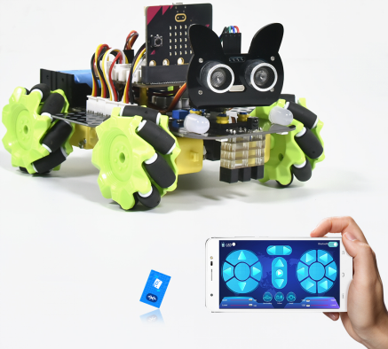

   Img

1. **Description**

In this lesson, we will control the smart car to perform multipurpose
functions.

2. **Preparation**

- Insert the micro:bit board into the slot of keyestudio
  4WD Mecanum Robot Car V2.0

- Place batteries into battery holder

- Dial power switch to ON end

- Connect the micro:bit to your computer via an USB cable

- Open the Web version of Makecode

**Steps：** Click the gear icon (Settings) in the upper right corner,
then click on Extensions to go to the library file selection screen, and
then click on the “Bluetooth” extension library (if it doesn’t exist,
search Bluetooth to find it), as shown below: 

|image178|

As the Bluetooth and extension radio can’t work together, therefore,
their extension libraries are not compatible.

Therefore, remove extension(s) and add Bluetooth please if you see the
following prompt box pop up.

|image179|

3. **Test Code**

Since the code is quite long, it won’t be displayed here. You can
directly go to the following path to find the corresponding code.

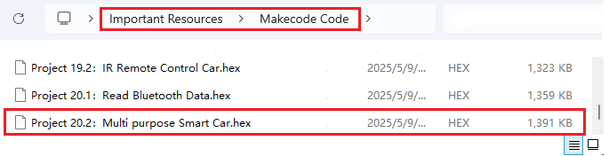

   Img

Click“JavaScript” to view the corresponding JavaScript code: ：

|image180|

4. **Test Result**

This experiment combines the previous projects to make the car to
perform actions via Bluetooth.

Enter Makecode online editor→Projecting Settings→\ |image181|, enable
“No Pairing….”(you could skip this step if you import test code
directly)

Download code to micro:bit board, dial POWER to ON end, and connect the
Bluetooth, then you can control the car via the Bluetooth App of
mecanum_robot.

**Note:** |image182|\ is used to adjust the speed, and |image183| can
only be dragged.

Common Problems
---------------

1. **The car has no reaction**

Please check whether the batteries are sufficient

Please check whether the wirings are correct

2. **Computers can’t recognize the USB ports**

Please ensure whether the microbit driver is installed

Please check whether the USB wire is in good condition.

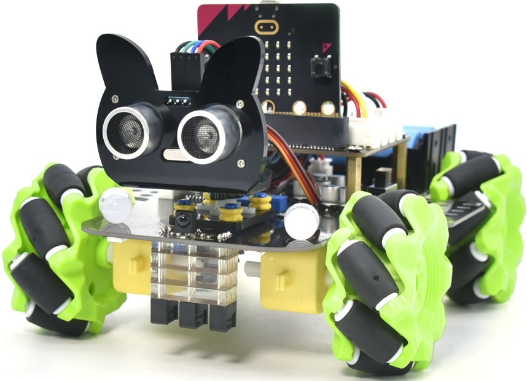
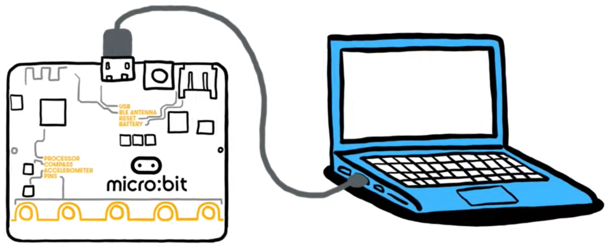
.. |image3| image:: ./media/image-20250903153355910-1764036560154-1.png
.. |image4| image:: ./media/Microbit-1764036560155-5.gif
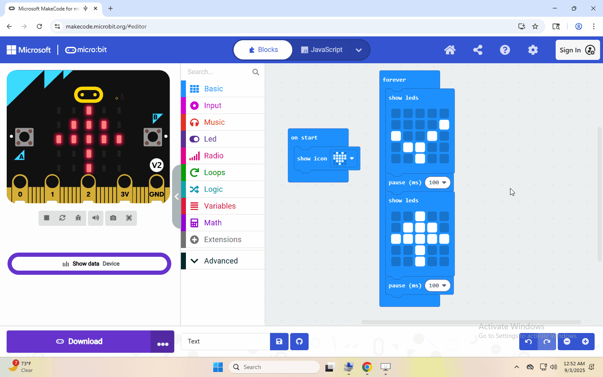
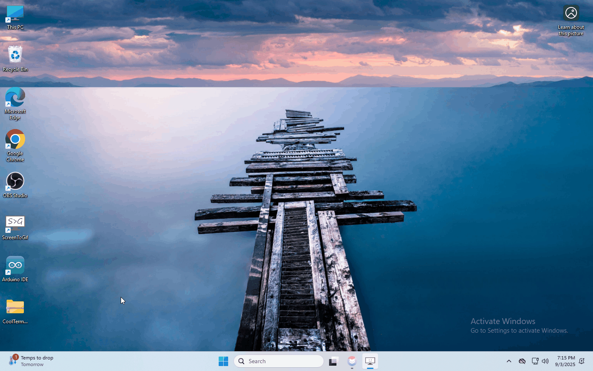
.. |image7| image:: ./media/1-1764036560155-7.png
.. |image8| image:: ./media/2356ba4c94ae3584430f119173f91469925077124a6252fd80568bc2c68f8d83-1764036560155-6.jpg
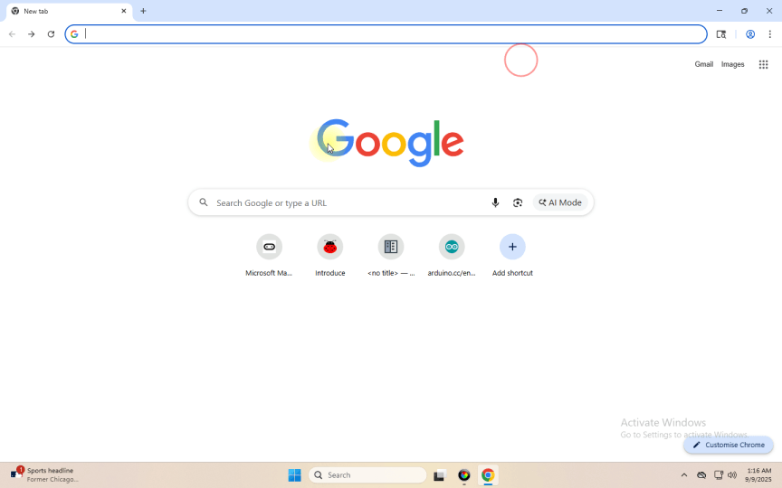
.. |image10| image:: ./media/Heartbeat-1764036560155-9.png
.. |image11| image:: ./media/Heartbeat1-1764036560155-11.gif
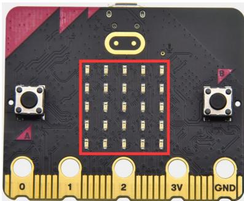
.. |image13| image:: ./media/image-20250904102610952-1764036560155-12.png
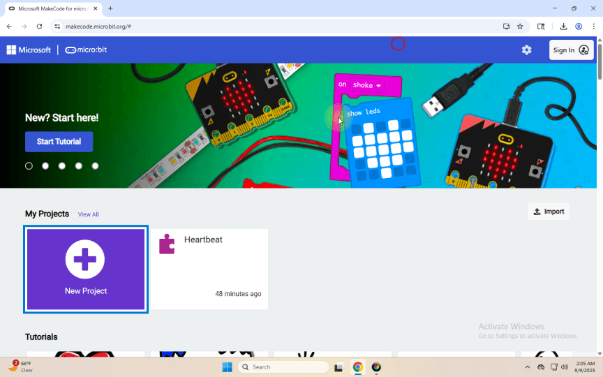
.. |image15| image:: ./media/4-1764036560155-20.png
.. |image16| image:: ./media/5-1764036560155-14.gif
.. |image17| image:: ./media/a693bf0fdb1627198fb157c88f41383e9bc0b93b8763ab6af4b833ba1439abbe-1764036560155-15.jpg
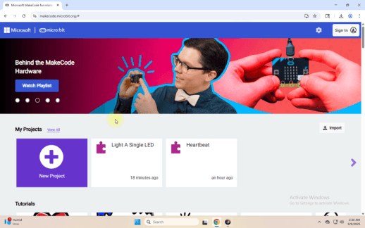
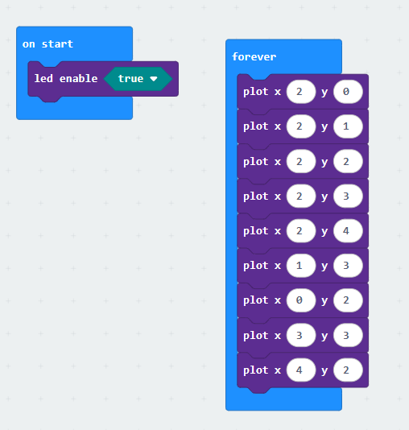
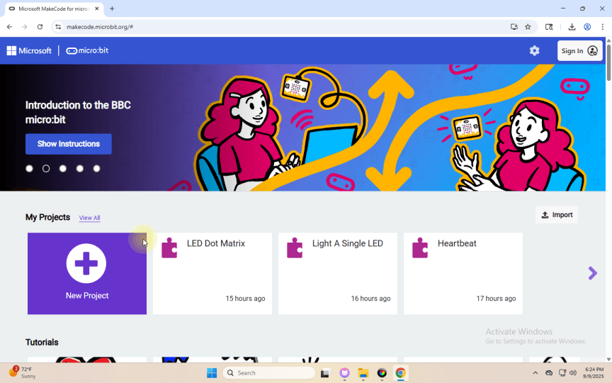
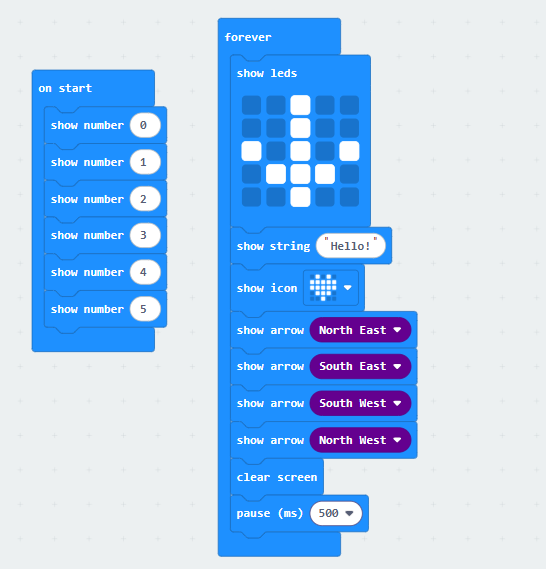
.. |image22| image:: ./media/10-1764036560155-22.gif
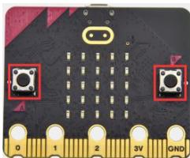
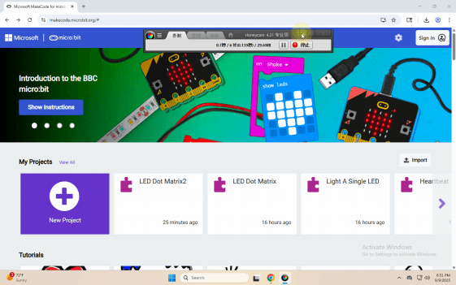
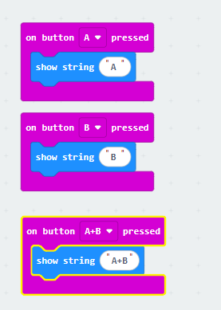
.. |image26| image:: ./media/12.gif
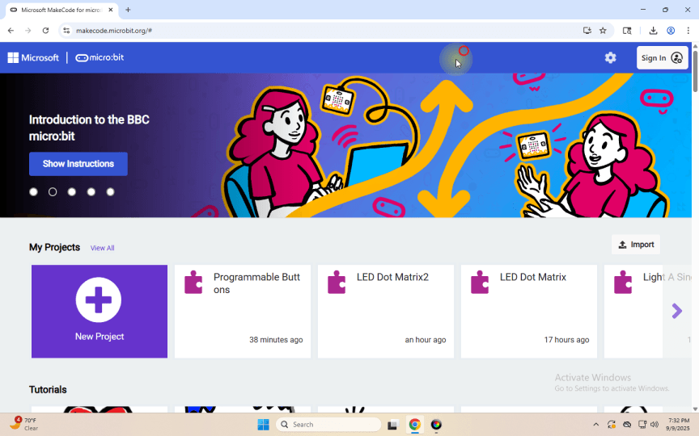
.. |image28| image:: ./media/image-20250910104143540-1764036560155-27.png
.. |image29| image:: ./media/14.gif
.. |image30| image:: ./media/c279cdbc53aa0f036fdcda2c4f2b0811feb324dfc18b4079f5c2afefe29d5eaf-1764036560155-30.jpg
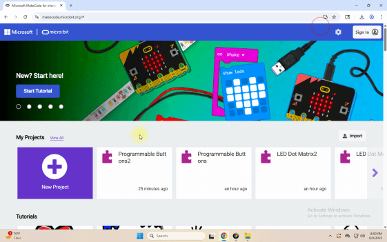
.. |image32| image:: ./media/16-1764036560155-31.gif
.. |image33| image:: ./media/Animation2-1764036560155-29.gif
.. |image34| image:: ./media/17-1764036560155-33.gif
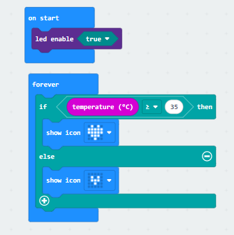
.. |image36| image:: ./media/image-20250905140357642-1764036560155-34.png
.. |image37| image:: ./media/image-20250905140444458-1764036560155-37.png
.. |image38| image:: ./media/18-1764036560155-35.gif
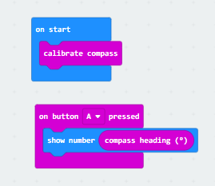
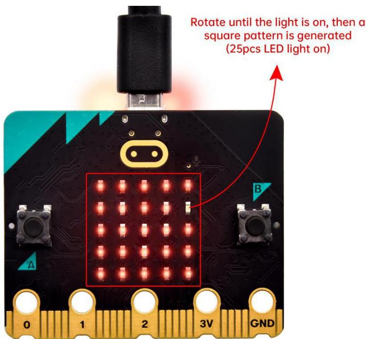
.. |image41| image:: ./media/19.gif
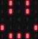
.. |image43| image:: ./media/20-1764036560155-42.gif
.. |image44| image:: ./media/21-1764036560155-40.gif
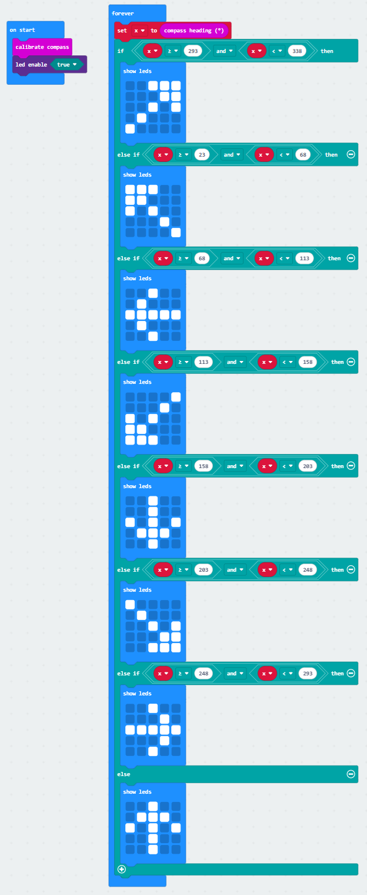
.. |image46| image:: ./media/22-1764036560155-46.gif
.. |image47| image:: ./media/1cb21f5abd6e06cd7081d135128579f0ef6870d66a6b9fdf92496a2263d51a24-1764036560155-43.jpg
.. |image48| image:: ./media/23-1764036560155-44.gif
.. |image49| image:: ./media/image-20250911135905779-1764036560155-50.png
.. |image50| image:: ./media/24-1764036560155-48.gif
.. |image51| image:: ./media/7b4f4d9814baf3cae97287c65207a0a0fa990ded2fdf55bdb80f5b0f820c60cc-1764036560155-45.jpg
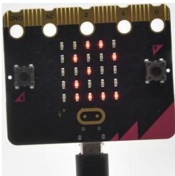
.. |image53| image:: ./media/c97cbe743d2d2cdc403b5010bf3b16faa3b76086642399f7da00cf8c6bac3584-1764036560155-52.jpg
.. |image54| image:: ./media/30099649e3d210eeb8bcb37957598674e74f569818ed17e8b30230d7de3ca42b-1764036560155-49.jpg
.. |image55| image:: ./media/b066419352c3c59679a76544378b7307337665b40e30d14126eb685bf9672c1f-1764036560155-57.jpg
.. |image56| image:: ./media/25-1764036560155-51.gif
.. |image57| image:: ./media/image-20250911143619630-1764036560155-54.png
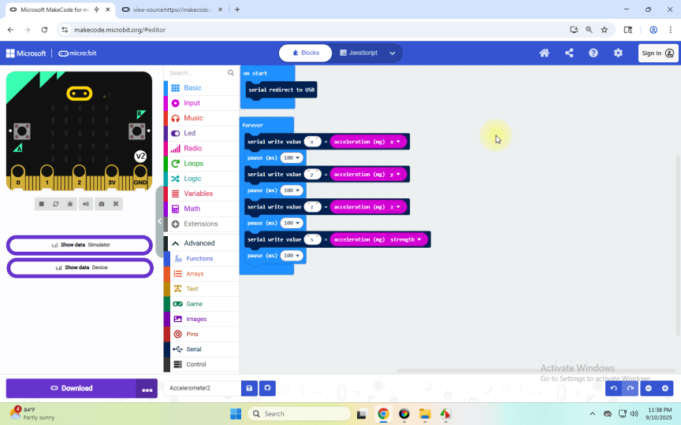
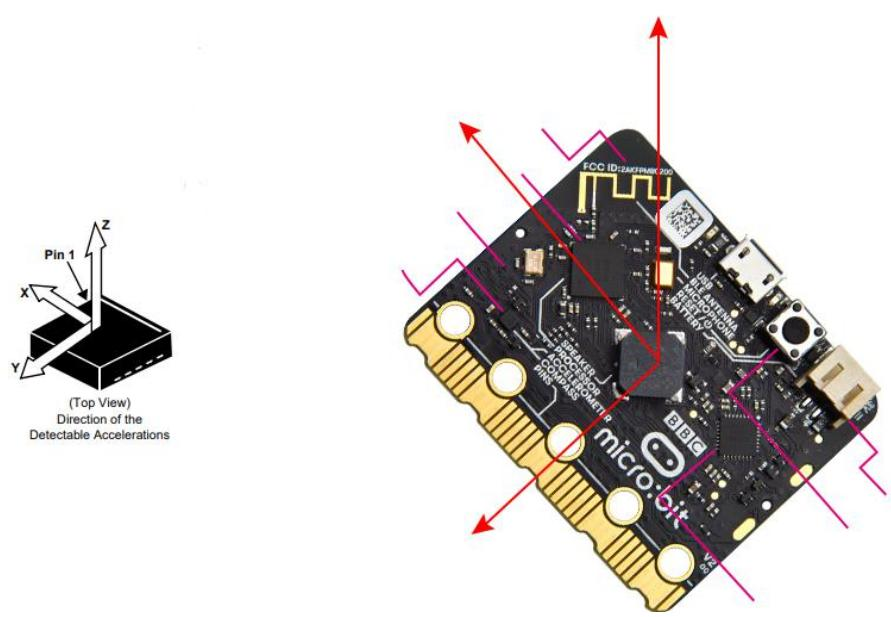
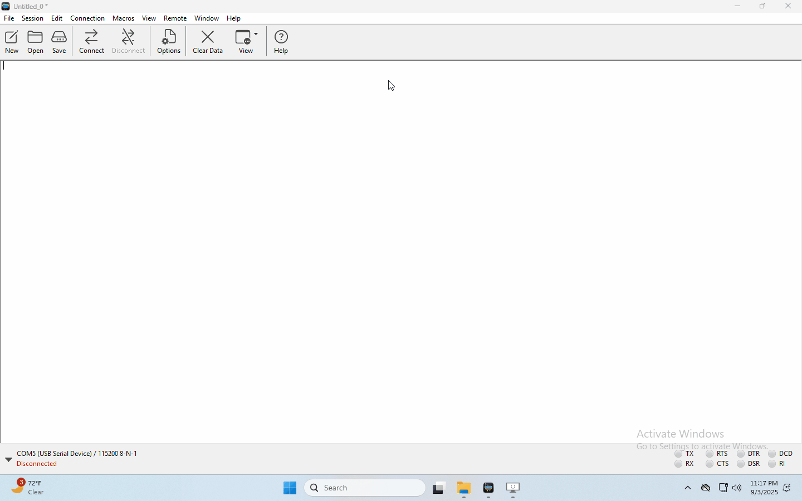
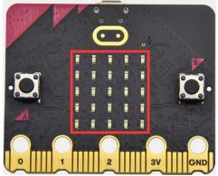
.. |image62| image:: ./media/27-1764036560155-58.gif
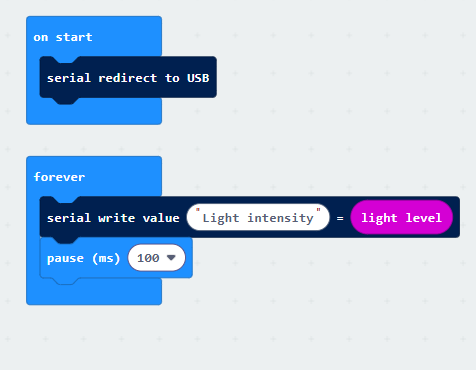
.. |image64| image:: ./media/28-1764036560156-63.gif
.. |image65| image:: ./media/Animation5-1764036560156-60.gif
.. |image66| image:: ./media/e08dd451289c9ff2a732e808f80595ca4a3ccbc339d27818157912ae9229e0f9-1764036560156-64.jpg
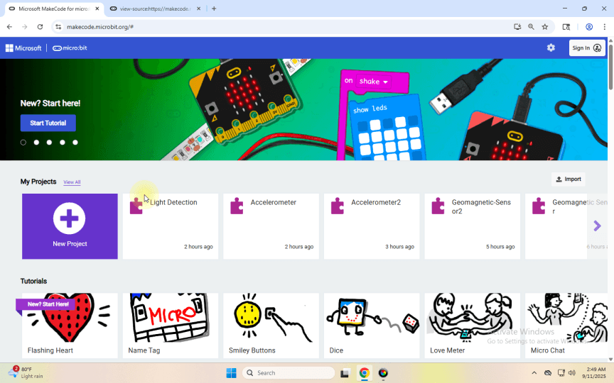
.. |image68| image:: ./media/image-20250911175254769-1764036560156-66.png
.. |image69| image:: ./media/30-1764036560156-65.gif
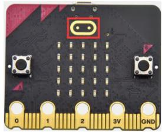
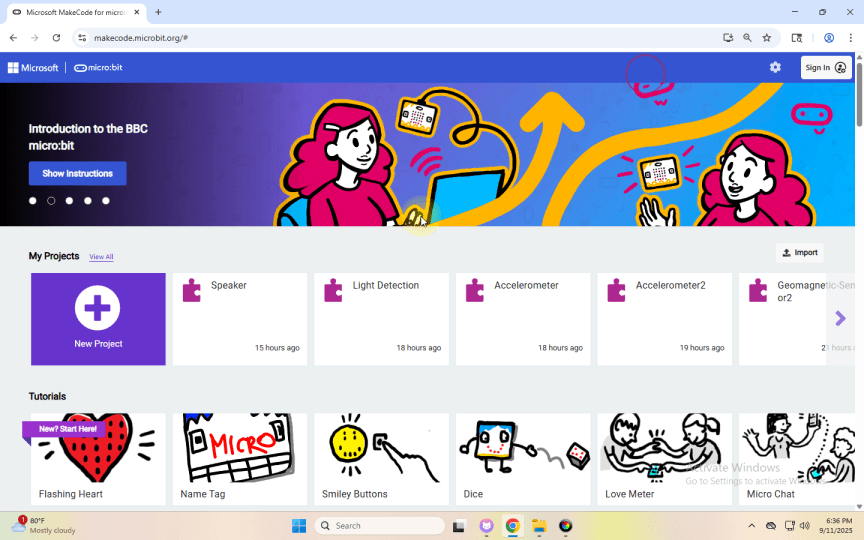
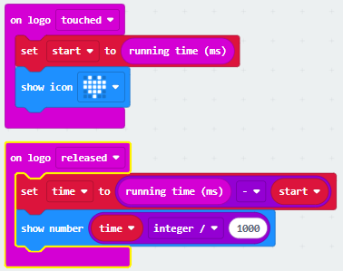
.. |image73| image:: ./media/32-1764036560156-70.gif
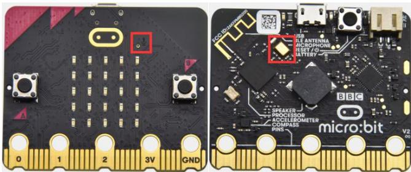
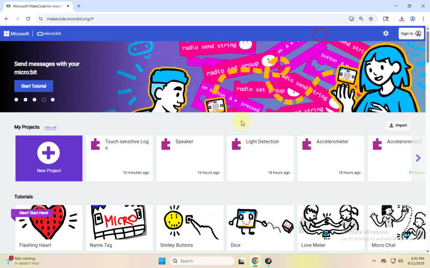
.. |image76| image:: ./media/image-20250912095411405-1764036560156-75.png
.. |image77| image:: ./media/35-1764036560156-74.gif
.. |image78| image:: ./media/36-1764036560156-72.gif
.. |image79| image:: ./media/image-20250912105611120-1764036560156-76.png
.. |image80| image:: ./media/37.gif

.. |image82| image:: ./media/android-1764036560156-82.gif
.. |image83| image:: ./media/ios-1764036560156-78.gif
.. |image84| image:: ./media/38-1764036560156-79.gif
.. |image85| image:: ./media/39-1764036560156-80.gif

.. |image87| image:: ./media/41-1764036560156-81.gif
.. |image88| image:: ./media/42-1764036560156-83.gif
.. |image89| image:: ./media/43-1764036560156-85.gif


.. |image93| image:: ./media/ode21.png

.. |image95| image:: ./media/e29.png


.. |image99| image:: ./media/ode23-1.png
.. |image100| image:: ./media/code23-2.png


.. |image107| image:: ./media/servo-2.png

.. |image109| image:: ./media/code25.png

.. |image111| image:: ./media/motor.png
.. |image112| image:: ./media/motor2.png


.. |image115| image:: ./media/code26.png

.. |image117| image:: ./media/code27.png

.. |image119| image:: ./media/Line-Tracking.png
.. |image120| image:: ./media/code28.png


.. |image123| image:: ./media/d1.png
.. |image124| image:: ./media/d2.png
.. |image125| image:: ./media/d3.png


.. |image128| image:: ./media/code29-4.png

.. |image130| image:: ./media/Ultrasonic1.png

.. |image132| image:: ./media/Ultrasonic3.png
.. |image133| image:: ./media/code30.png

.. |image135| image:: ./media/abc.png
.. |image136| image:: ./media/c8.png
.. |image137| image:: ./media/d10.png
.. |image138| image:: ./media/code31-1.png


.. |image143| image:: ./media/IR-Control.png
.. |image144| image:: ./media/IR-Control1.png
.. |image145| image:: ./media/code33.png

.. |image147| image:: ./media/c0.png
.. |image148| image:: ./media/c1.png
.. |image149| image:: ./media/c10.png

.. |image151| image:: ./media/code34.png

.. |image153| image:: ./media/code34-2.png
.. |image154| image:: ./media/button-up.png
.. |image155| image:: ./media/button-left.png
.. |image156| image:: ./media/button-right.png
.. |image157| image:: ./media/button-down.png
.. |image158| image:: ./media/button-ok.png
.. |image159| image:: ./media/microbit13.png

.. |image161| image:: ./media/Bluetooth-2.png
.. |image162| image:: ./media/code36.png
.. |image163| image:: ./media/code36-1.png
.. |image164| image:: ./media/cba.png
.. |image165| image:: ./media/cba1.png
.. |image166| image:: ./media/cba2.png
.. |image167| image:: ./media/e4.png
.. |image168| image:: ./media/e5.png
.. |image169| image:: ./media/QR-code.png
.. |image170| image:: ./media/app1.png
.. |image171| image:: ./media/app2.png

.. |image173| image:: ./media/app4.png
.. |image174| image:: ./media/app5.png

.. |image176| image:: ./media/d12.png
.. |image177| image:: ./media/app7.jpg

.. |image179| image:: ./media/Bluetooth-2.png

.. |image181| image:: ./media/abcd.png


