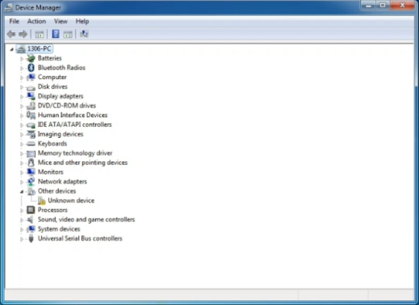
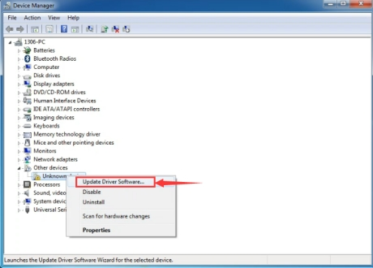
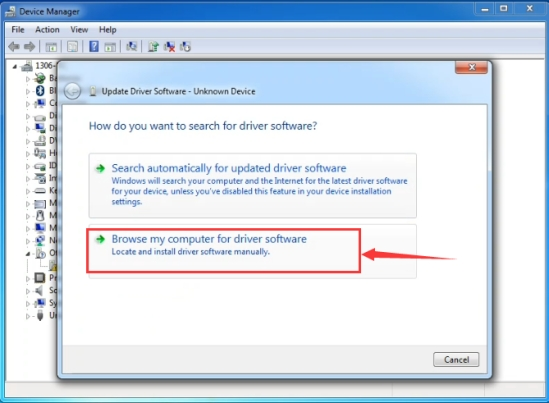
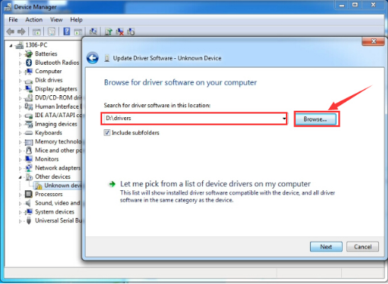
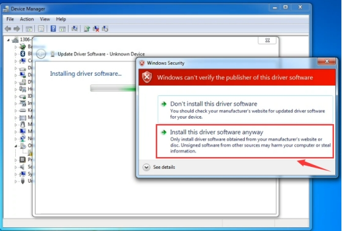
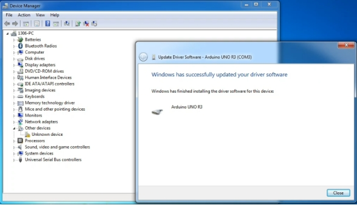
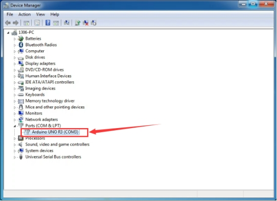

4. Driver installation
======================

Download the driver: :download:`drivers <./drivers.7z>`

For different operating system, there may be slight difference in
installation method. Below is an example in WIN 7.

1、When you connect Arduino Uno to your computer at the first time,
right click “Computer” —> “Properties”—> “Device manager”, you can see
“Unknown devices”.

|image1|

2、Click “Unknown devices”, select “Update Driver software”.

|image2|

3、In this page, click “Browse my computer for driver software”.

|image3|

4、Find the “drivers” file.

|image4|

5、Click “Next”; select “Install this driver software anyway” to begin
the installation.

|image5|

6、Installation completed; click “Close”.

|image6|

7、After driver is installed, go to “Device manager” again. Right click
“Computer” —> “Properties”—> “Device manager”, you can see UNO device as
below figure shows, also with the Com port info.

|image7|

